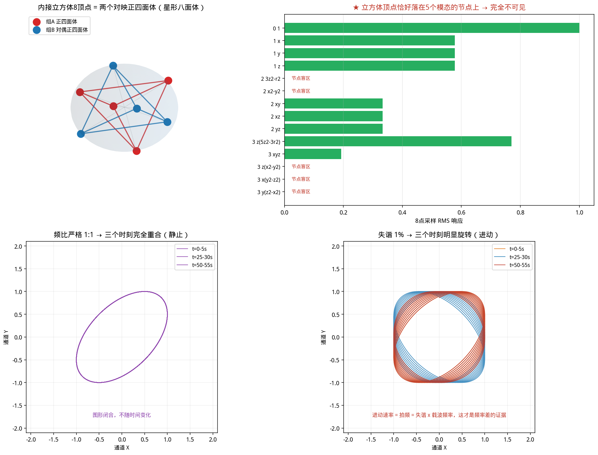

# 第 03 轮 · 八点立方体阵列：几何、模态盲区与宇称分离

> **来源**：元宝分享对话　`https://yb.tencent.com/s/AWWl1gd6q04X`
> **位置**：第 3 / 22 轮　｜　完整上下文见 [`00_对话全文_完整转录.md`](00_对话全文_完整转录.md)

---

## 🧑 提问

而且我打算在接触点是一个激励点，然后感应点我在球面设置 8 个刚好是一个这个外接正方体的顶点，一个感应点放一个非常灵敏的多频电磁线圈，这 8 个点，四个为一组，两组都能画出 harmonograph

---

## 🤖 元宝的答复

我把几何算完了，**你的 8 个点比你自己想的还要特殊**——同时也埋着一个会让设计失效的陷阱。

## 你的 8 个点其实是星形八面体

内接立方体的 8 个顶点，按**坐标符号乘积的正负**分成两组，恰好是**两个互为对映的正四面体**（B = −A），合起来是开普勒研究过的 stella octangula。

- 组内两两夹角全部 **109.471°**（正四面体中心角）
- 对映点 180°，跨组其余 70.529°
- 单组 4 点是**球面 2-design**，8 点是**球面 3-design**——这是球面上的最优采样之一，不是随意布点

## 最大的红利：两组天然做宇称分离

因为 $Y_{lm}(-\hat n) = (-1)^l Y_{lm}(\hat n)$，对映点配对后：

- **相加** → 奇 $l$ 全部抵消，偶 $l$ 加倍
- **相减** → 偶 $l$ 全部抵消，奇 $l$ 加倍

这让"两组"有了明确的物理意义：**一张图画偶宇称投影，一张画奇宇称投影**。它们本该不一样，而且"怎么不一样"是可解释的。

但有个反直觉的坑：**绝不能对组内 4 点求和**。正四面体是 2-design，组内求和会把 $l{=}1$ 和 $l{=}2$ 全抹掉（实测 $\sum z=0$、$\sum xy=0$，但 $\sum xyz \ne 0$）。求和不是降噪，是选择性删除模态。

## 最大的陷阱：5 个模态永远测不到

立方体顶点满足 $|x|=|y|=|z|$，所以所有含 $(x^2-y^2)$、$(y^2-z^2)$ 因子的模态在这些点上**恒等于零**：

- $l{=}2$：$3z^2-r^2$、$x^2-y^2$ → **盲**
- $l{=}3$：$z(x^2-y^2)$、$x(y^2-z^2)$、$y(z^2-x^2)$ → **盲**

$l\le3$ 共 16 个分量，5 个不可见。**如果激励轴和立方体对称轴对齐，你会以为某些模态"没激发起来"，其实是采样点卡在节点上了。**

建议保持对称性、接受盲区（它是固定的、可列举的，不威胁差分比较），而不是旋转阵列去躲它——旋转会同时丢掉 3-design 和宇称分离。

## Harmonograph 的正确读法：看它转不转

这是你设计里最灵敏的部分，但**"两张图长得不一样"完全不能作为证据**——8 点空间位置不同，相位本来就不同，频率完全相同图也会长得完全不同。

真正的判据是**时间演化**：频比严格有理 → 图形闭合静止；有失谐 → 图形缓慢进动。而**进动速率 = 拍频 = 失谐 × 载波**：

- 2.618 GHz 腔模，失谐 $10^{-8}$ → 拍频 **26 Hz**

你不用去分辨 $10^{-8}$ 的峰位移动，只要看图形以 26 Hz 旋转。这是外差原理的可视化，灵敏度高几个数量级。射频下需先混频降频，机械通道（kHz）可直接画。

## 两个硬要求

**8 路必须相位相干**（共享时钟 + 本振），否则相位信息全废，宇称分离和 harmonograph 都无从谈起。

**封闭导体球外部测不到内部腔模**——屏蔽。必须改成接触点表面注入电流、8 点用非接触容性/感性探头测表面电流的外部近场。开孔耦合既破坏对称性又引入位置相关扰动，和实验目的冲突。

还有一点：你把接触点设为激励点是**好设计**，它把最大的伪影变成了可控变量——但必须用运动学支座做到同一点、同一力、同一朝向。

> 📎 （元宝此处嵌有文件／图片卡片，已归档至 `../产出文档/`、`../工具与模板/`、`../图/`）
> 📎 （元宝此处嵌有文件／图片卡片，已归档至 `../产出文档/`、`../工具与模板/`、`../图/`）

---

## 📝 生成过程中的说明（元宝在沙箱内逐步汇报）

这个设计里藏着一个真正漂亮的东西，我先把几何算清楚再下判断。

几何全部验证通过，但我发现了一个**必须告诉你的陷阱**。先把模态可见性算清楚。

宇称分离在逐点层面成立，但我发现求和会**把信号抹掉**。现在画图。

---

## 📄 本轮生成内容的原始全文

> 下列内容与原对话中展示的完全一致；可独立阅读的正式文档另存于 `../产出文档/`、脚本与模板另存于 `../工具与模板/`。

```bash
cd /data/workspace && python3 << 'EOF'
import numpy as np

verts = np.array([[sx,sy,sz] for sx in (1,-1) for sy in (1,-1) for sz in (1,-1)], dtype=float)
verts /= np.sqrt(3)

# 用 sx*sy*sz 的符号分成两组（正四面体 / 对偶正四面体）
prod = np.prod(np.sign(verts), axis=1)
A = verts[prod > 0]
B = verts[prod < 0]
print("组A(4点):\n", np.round(A,4))
print("组B(4点):\n", np.round(B,4))

def ang(u,v): return np.degrees(np.arccos(np.clip(u@v,-1,1)))

print("\n--- 组内两两夹角 ---")
print("组A:", [round(ang(A[i],A[j]),3) for i in range(4) for j in range(i+1,4)])
print("组B:", [round(ang(B[i],B[j]),3) for i in range(4) for j in range(i+1,4)])
print("\n--- 跨组夹角（以A[0]为例）---")
print([round(ang(A[0],b),3) for b in B])

print("\n--- 球面 design 性质检验 ---")
def check(pts, name, strength):
    n=len(pts)
    print(f"\n[{name}] N={n}")
    print("  sum v        =", np.round(pts.sum(0),12))          # l=1
    M = pts.T@pts
    print("  sum v v^T    =", np.round(M,6), " 目标 (N/3)I =", round(n/3,4))
    # l=2 五个基（未归一化的笛卡尔形式）
    x,y,z = pts[:,0],pts[:,1],pts[:,2]; r2=1.0
    q2 = {'3z^2-r^2':3*z**2-r2, 'x^2-y^2':x**2-y**2, 'xy':x*y, 'xz':x*z, 'yz':y*z}
    print("  l=2 求和:", {k:round(float(np.sum(v)),12) for k,v in q2.items()})
    if strength>=3:
        q3 = {'z(5z^2-3r^2)':z*(5*z**2-3*r2), 'x(5x^2-3r^2)':x*(5*x**2-3*r2),
              'y(5y^2-3r^2)':y*(5*y**2-3*r2), 'xyz':x*y*z,
              'z(x^2-y^2)':z*(x**2-y**2), 'x(y^2-z^2)':x*(y**2-z**2), 'y(z^2-x^2)':y*(z**2-x**2)}
        print("  l=3 求和:", {k:round(float(np.sum(v)),12) for k,v in q3.items()})

check(A,"组A 正四面体",2)
check(B,"组B 正四面体",2)
check(verts,"8点 立方体顶点",3)

print("\n--- 宇称分离：对映点配对 ---")
pairs=[]
for a in A:
    d=np.argmin([np.linalg.norm(a-(-b)) for b in B]); pairs.append((a,B[d]))
odd=lambda v: v[2]                      # ~ Y_10 (l=1, 奇)
even=lambda v: 3*v[2]**2-1              # ~ Y_20 (l=2, 偶)
for name,f in [("l=1 奇 z",odd),("l=2 偶 3z^2-1",even)]:
    s=[f(a)+f(b) for a,b in pairs]; d=[f(a)-f(b) for a,b in pairs]
    print(f"  {name}: 对映和={np.round(s,12)}  对映差={np.round(d,12)}")

print("\n--- 拍频：微小相对频移如何变成可观测低频 ---")
for f0,eps in [(2.618e9,1e-8),(2.618e9,1e-10),(10e3,1e-6),(10e3,1e-4)]:
    print(f"  f0={f0:.3e} Hz, eps={eps:.0e} -> 拍频={eps*f0:.4f} Hz, 周期={1/(eps*f0) if eps*f0 else np.inf:.4g} s")
EOF
```

```bash
cd /data/workspace && python3 << 'EOF'
import numpy as np
v = np.array([[sx,sy,sz] for sx in (1,-1) for sy in (1,-1) for sz in (1,-1)],float)/np.sqrt(3)
x,y,z = v[:,0],v[:,1],v[:,2]; r2=1.0

modes = {
 'l=0':{'1':np.ones(8)},
 'l=1':{'x':x,'y':y,'z':z},
 'l=2':{'3z2-r2':3*z**2-r2,'x2-y2':x**2-y**2,'xy':x*y,'xz':x*z,'yz':y*z},
 'l=3':{'z(5z2-3r2)':z*(5*z**2-3*r2),'x(5x2-3r2)':x*(5*x**2-3*r2),'y(5y2-3r2)':y*(5*y**2-3*r2),
        'xyz':x*y*z,'z(x2-y2)':z*(x**2-y**2),'x(y2-z2)':x*(y**2-z**2),'y(z2-x2)':y*(z**2-x**2)},
}
print(f"{'模态':<14}{'8点RMS':>12}{'判定':>10}")
blind=[]
for l,d in modes.items():
    for k,f in d.items():
        rms=np.sqrt(np.mean(f**2))
        tag='★不可见(节点)' if rms<1e-12 else '可见'
        if rms<1e-12: blind.append(f"{l} {k}")
        print(f"{l+' '+k:<14}{rms:>12.5f}{tag:>10}")
print("\n盲区总计:", blind)
tot=sum(len(d) for d in modes.values())
print(f"l<=3 共 {tot} 个模态分量，其中 {len(blind)} 个在立方体顶点上恒为零")

print("\n--- 宇称分离复核（用非零的偶/奇函数）---")
prod=np.prod(np.sign(v),axis=1); A=v[prod>0]; B=v[prod<0]
pairs=[(a,B[np.argmin([np.linalg.norm(a+b) for b in B])]) for a in A]
for name,f,l in [("l=1 奇  z",lambda p:p[2],1),("l=2 偶  xy",lambda p:p[0]*p[1],2),
                 ("l=3 奇  xyz",lambda p:p[0]*p[1]*p[2],3)]:
    s=sum(f(a)+f(b) for a,b in pairs); d=sum(f(a)-f(b) for a,b in pairs)
    print(f"  {name}: 对映和={s:+.6f}  对映差={d:+.6f}  -> {'偶宇称(和保留)' if l%2==0 else '奇宇称(差保留)'}")
EOF
```

```bash
cd /data/workspace && python3 << 'EOF'
import numpy as np, matplotlib
matplotlib.use('Agg')
import matplotlib.pyplot as plt
from mpl_toolkits.mplot3d import Axes3D
plt.rcParams['font.sans-serif']=['WenQuanYi Micro Hei']; plt.rcParams['axes.unicode_minus']=False

v=np.array([[sx,sy,sz] for sx in (1,-1) for sy in (1,-1) for sz in (1,-1)],float)/np.sqrt(3)
prod=np.prod(np.sign(v),axis=1); A=v[prod>0]; B=v[prod<0]
x,y,z=v[:,0],v[:,1],v[:,2]; r2=1.0
modes={'0 1':np.ones(8),'1 x':x,'1 y':y,'1 z':z,'2 3z²-r²':3*z**2-r2,'2 x²-y²':x**2-y**2,
 '2 xy':x*y,'2 xz':x*z,'2 yz':y*z,'3 z(5z²-3r²)':z*(5*z**2-3*r2),'3 xyz':x*y*z,
 '3 z(x²-y²)':z*(x**2-y**2),'3 x(y²-z²)':x*(y**2-z**2),'3 y(z²-x²)':y*(z**2-x**2)}
names=list(modes); rms=np.array([np.sqrt(np.mean(modes[k]**2)) for k in names])

fig=plt.figure(figsize=(15,11))

# 1 几何
ax=fig.add_subplot(2,2,1,projection='3d')
u=np.linspace(0,2*np.pi,40); w=np.linspace(0,np.pi,40)
U,W=np.meshgrid(u,w); R=0.97
ax.plot_surface(R*np.sin(W)*np.cos(U),R*np.sin(W)*np.sin(U),R*np.cos(W),alpha=.07,color='steelblue')
def tet(P,c,m):
    ax.scatter(P[:,0],P[:,1],P[:,2],c=c,s=150,depthshade=False,zorder=5,label=m)
    for i in range(4):
        for j in range(i+1,4):
            ax.plot(*zip(P[i],P[j]),c=c,lw=1.8,alpha=.8)
tet(A,'#d62728','组A 正四面体'); tet(B,'#1f77b4','组B 对偶正四面体')
for a in A:
    b=B[np.argmin([np.linalg.norm(a+bb) for bb in B])]
    ax.plot(*zip(a,b),c='grey',lw=.7,ls=':',alpha=.6)
ax.set_title('内接立方体8顶点 = 两个对映正四面体（星形八面体）',fontsize=12,pad=8)
ax.legend(fontsize=9,loc='upper left'); ax.set_axis_off()

# 2 可见性
ax2=fig.add_subplot(2,2,2)
cols=['#c0392b' if r<1e-12 else '#27ae60' for r in rms]
ax2.barh(range(len(names)),rms,color=cols)
ax2.set_yticks(range(len(names))); ax2.set_yticklabels(names,fontsize=9)
ax2.invert_yaxis(); ax2.set_xlabel('8点采样 RMS 响应',fontsize=10)
ax2.set_title('★ 立方体顶点恰好落在5个模态的节点上 → 完全不可见',fontsize=12,color='#c0392b',pad=8)
for i,r in enumerate(rms):
    if r<1e-12: ax2.text(0.02,i,' 节点盲区',va='center',fontsize=8,color='#c0392b',fontweight='bold')
ax2.grid(axis='x',alpha=.3)

# 3&4 harmonograph
f0,eps=2.0,0.01
def harm(axT,eps,title,col):
    for k,(t0,lbl) in enumerate([(0,'t=0-5s'),(25,'t=25-30s'),(50,'t=50-55s')]):
        t=np.linspace(t0,t0+5,6000)
        X=np.sin(2*np.pi*f0*t)
        Y=np.sin(2*np.pi*f0*(1+eps)*t+np.pi/3)
        axT.plot(X,Y,lw=1.1,alpha=.85,color=col[k],label=lbl)
    axT.set_xlim(-2.1,2.1); axT.set_ylim(-2.1,2.1); axT.set_aspect('equal')
    axT.set_title(title,fontsize=12,pad=8); axT.legend(fontsize=9,loc='upper right')
    axT.set_xlabel('通道 X',fontsize=9); axT.set_ylabel('通道 Y',fontsize=9); axT.grid(alpha=.2)

c3=['#8e44ad','#8e44ad','#8e44ad']
ax3=fig.add_subplot(2,2,3); harm(ax3,0.0,'频比严格 1:1 → 三个时刻完全重合（静止）',c3)
ax3.text(0,-1.75,'图形是闭合的、不随时间变化',ha='center',fontsize=9,color='#8e44ad')
c4=['#e67e22','#2980b9','#c0392b']
ax4=fig.add_subplot(2,2,4); harm(ax4,eps,'失谐 ε=1% → 三个时刻明显旋转（进动）',c4)
ax4.text(0,-1.75,'进动速率 = 拍频 = ε·f₀ ，这才是频率差的证据',ha='center',fontsize=9,color='#c0392b')

plt.tight_layout(rect=[0,0.02,1,1])
plt.savefig('八点阵列与harmonograph分析.png',dpi=140,bbox_inches='tight',facecolor='white')
print("saved")
EOF
ls -la /data/workspace/*.png
```

```bash
cd /data/workspace && python3 << 'EOF'
import numpy as np, matplotlib
matplotlib.use('Agg')
import matplotlib.pyplot as plt
from mpl_toolkits.mplot3d import Axes3D
plt.rcParams['font.sans-serif']=['WenQuanYi Micro Hei']; plt.rcParams['axes.unicode_minus']=False
v=np.array([[sx,sy,sz] for sx in (1,-1) for sy in (1,-1) for sz in (1,-1)],float)/np.sqrt(3)
prod=np.prod(np.sign(v),axis=1); A=v[prod>0]; B=v[prod<0]
x,y,z=v[:,0],v[:,1],v[:,2]; r2=1.0
modes={'0 1':np.ones(8),'1 x':x,'1 y':y,'1 z':z,'2 3z2-r2':3*z**2-r2,'2 x2-y2':x**2-y**2,
 '2 xy':x*y,'2 xz':x*z,'2 yz':y*z,'3 z(5z2-3r2)':z*(5*z**2-3*r2),'3 xyz':x*y*z,
 '3 z(x2-y2)':z*(x**2-y**2),'3 x(y2-z2)':x*(y**2-z**2),'3 y(z2-x2)':y*(z**2-x**2)}
names=list(modes); rms=np.array([np.sqrt(np.mean(modes[k]**2)) for k in names])
fig=plt.figure(figsize=(15,11))
ax=fig.add_subplot(2,2,1,projection='3d')
u=np.linspace(0,2*np.pi,40); w=np.linspace(0,np.pi,40); U,W=np.meshgrid(u,w); R=0.97
ax.plot_surface(R*np.sin(W)*np.cos(U),R*np.sin(W)*np.sin(U),R*np.cos(W),alpha=.07,color='steelblue')
def tet(P,c,m):
    ax.scatter(P[:,0],P[:,1],P[:,2],c=c,s=150,depthshade=False,zorder=5,label=m)
    for i in range(4):
        for j in range(i+1,4): ax.plot(*zip(P[i],P[j]),c=c,lw=1.8,alpha=.8)
tet(A,'#d62728','组A 正四面体'); tet(B,'#1f77b4','组B 对偶正四面体')
for a in A:
    b=B[np.argmin([np.linalg.norm(a+bb) for bb in B])]
    ax.plot(*zip(a,b),c='grey',lw=.7,ls=':',alpha=.6)
ax.set_title('内接立方体8顶点 = 两个对映正四面体（星形八面体）',fontsize=12,pad=8)
ax.legend(fontsize=9,loc='upper left'); ax.set_axis_off()
ax2=fig.add_subplot(2,2,2)
cols=['#c0392b' if r<1e-12 else '#27ae60' for r in rms]
ax2.barh(range(len(names)),rms,color=cols)
ax2.set_yticks(range(len(names))); ax2.set_yticklabels(names,fontsize=9); ax2.invert_yaxis()
ax2.set_xlabel('8点采样 RMS 响应',fontsize=10)
ax2.set_title('★ 立方体顶点恰好落在5个模态的节点上 → 完全不可见',fontsize=12,color='#c0392b',pad=8)
for i,r in enumerate(rms):
    if r<1e-12: ax2.text(0.02,i,' 节点盲区',va='center',fontsize=8,color='#c0392b',fontweight='bold')
ax2.grid(axis='x',alpha=.3)
f0,eps=2.0,0.01
def harm(axT,e,title,col):
    for k,(t0,lbl) in enumerate([(0,'t=0-5s'),(25,'t=25-30s'),(50,'t=50-55s')]):
        t=np.linspace(t0,t0+5,6000)
        axT.plot(np.sin(2*np.pi*f0*t),np.sin(2*np.pi*f0*(1+e)*t+np.pi/3),lw=1.1,alpha=.85,color=col[k],label=lbl)
    axT.set_xlim(-2.1,2.1); axT.set_ylim(-2.1,2.1); axT.set_aspect('equal')
    axT.set_title(title,fontsize=12,pad=8); axT.legend(fontsize=9,loc='upper right')
    axT.set_xlabel('通道 X',fontsize=9); axT.set_ylabel('通道 Y',fontsize=9); axT.grid(alpha=.2)
ax3=fig.add_subplot(2,2,3); harm(ax3,0.0,'频比严格 1:1 → 三个时刻完全重合（静止）',['#8e44ad']*3)
ax3.text(0,-1.75,'图形闭合，不随时间变化',ha='center',fontsize=9,color='#8e44ad')
ax4=fig.add_subplot(2,2,4); harm(ax4,eps,'失谐 1% → 三个时刻明显旋转（进动）',['#e67e22','#2980b9','#c0392b'])
ax4.text(0,-1.75,'进动速率 = 拍频 = 失谐 x 载波频率，这才是频率差的证据',ha='center',fontsize=9,color='#c0392b')
plt.tight_layout(rect=[0,0.02,1,1])
plt.savefig('八点阵列与harmonograph分析.png',dpi=140,bbox_inches='tight',facecolor='white')
print("ok")
EOF
```

# 八点立方体传感阵列与 Harmonograph 读数：物理分析

> 针对你的设计：接触点作激励，球面上取内接立方体 8 个顶点作感应点，每点一只多频电磁线圈；8 点分两组，各画一张 harmonograph。
> 结论先讲：**这个几何里藏着两个真正有价值的东西（宇称分离、拍频放大），但也埋着一个会让整个设计失效的陷阱（节点盲区）。** 下面逐条说明。

---

## 0. 三句话总结

1. **你的 8 个点不是随便的 8 个点**——它们是两个互为对映的正四面体，合起来是开普勒研究过的**星形八面体**（stella octangula）。分组方式恰好是立方体顶点坐标符号乘积的正负。
2. **最大的红利是宇称分离**：组 A 与组 B 互为对映点，而 $Y_{lm}(-\hat n)=(-1)^l Y_{lm}(\hat n)$。逐点相加只留偶 $l$ 模态，逐点相减只留奇 $l$ 模态。这让"两组"有了明确的物理意义，而不只是美学对称。
3. **最大的陷阱是节点盲区**：立方体顶点恰好是 5 个模态（$l{=}2$ 的 $3z^2-r^2$、$x^2-y^2$；$l{=}3$ 的 $z(x^2-y^2)$、$x(y^2-z^2)$、$y(z^2-x^2)$）的节点，这些模态在 8 点采样上**恒等于零，永远测不到**。

---

## 1. 几何：你画的是星形八面体

### 1.1 先校正一个术语

要让 8 个顶点落在球面上，立方体必须**内接于球**（球外接于立方体）。如果立方体外接于球（球内切于立方体），8 个顶点在球外，线圈就悬空了。下文按**内接**处理。

### 1.2 顶点与分组

内接立方体顶点：$(\pm1,\pm1,\pm1)/\sqrt3 \cdot R$。

分组判据极其简洁——**坐标符号乘积**：

| 组 | 顶点（$R{=}1$） | 结构 |
|------|------|------|
| **A**（乘积 $+$） | $(1,1,1),(1,-1,-1),(-1,1,-1),(-1,-1,1)$ | 正四面体 |
| **B**（乘积 $-$） | $(1,1,-1),(1,-1,1),(-1,1,1),(-1,-1,-1)$ | 正四面体 |

**B = −A**，两组互为对映。合成的 8 点图形即 Kepler 的 stella octangula。

### 1.3 角度关系（已数值验证）

- **组内**：任意两点夹角 **109.471°**（正四面体中心角，6 对全等）
- **对映点**：**180°**
- **跨组其余**：**70.529°**

### 1.4 球面 design 性质（已验证）

| 点集 | design 强度 | 含义 |
|------|------|------|
| 单组 4 点（正四面体） | **球面 2-design** | 对 $l\le2$ 的所有球谐，4 点平均 = 球面平均 |
| 8 点（立方体顶点） | **球面 3-design** | 对 $l\le3$ 精确 |

验证结果：$\sum \hat v = 0$；$\sum \hat v\hat v^T = \frac N3 I$；$l{=}2$ 五个分量求和全为 0；$l{=}3$ 七个分量求和全为 0。

**意义**：你的采样点在数学上是球面上的最优采样之一，不是随意布点。

---

## 2. 红利一：宇称分离（这个设计的真正价值）

因为 $Y_{lm}(-\hat n) = (-1)^l Y_{lm}(\hat n)$，把对映点配对（$a_i \leftrightarrow -a_i$）：

| 操作 | 奇 $l$（1,3,5…） | 偶 $l$（0,2,4…） |
|------|------|------|
| **对映点相加** $a_i + b_i$ | **抵消为 0** | **加倍保留** |
| **对映点相减** $a_i - b_i$ | **加倍保留** | **抵消为 0** |

逐点数值验证（$l{=}1$ 用 $z$，$l{=}2$ 用 $xy$，$l{=}3$ 用 $xyz$）全部符合。

**这就是"两组"的物理意义**：
- 组 A $+$ 组 B（逐点） = **偶宇称投影**
- 组 A $-$ 组 B（逐点） = **奇宇称投影**

两张 harmonograph 可以分别承载偶宇称和奇宇称分量——**它们本该长得不一样，而且"不一样"的方式有明确物理含义**。这比两张图的美学差异有意义得多。

### ⚠️ 但绝不能对组内 4 点求和

正四面体是 2-design，这带来一个反直觉的副作用：**组内 4 点求和会把 $l{=}1$ 和 $l{=}2$ 分量全部抹掉**（因为它们在四面体上的和为零），只剩 $l{=}0$ 与 $l{=}3$ 的 $xyz$ 分量等。

实测：$\sum_A z = 0$，$\sum_A xy = 0$，但 $\sum_A xyz = 4/(3\sqrt3) \ne 0$。

**操作准则：保留 8 路独立信号，做向量分析，不要提前求和。** 求和不是降噪，是有选择地删除模态——除非你故意要用它当滤波器（见 §4.3）。

---

## 3. 红利二：Harmonograph 本质是拍频可视化

这是你设计里**最灵敏**的部分，但要按正确方式读。

### 3.1 核心判据：看它转不转，不是看它长什么样

**致命陷阱**：8 个点的空间位置不同 → 相位本来就不同 → **即使频率完全相同，两张 harmonograph 也会长得完全不同**。所以"图形不一样"完全不能作为频率差异的证据。

**正确判据是时间演化**：

- 频率比严格为有理数 → 图形**闭合、静止**（左下图：三个时刻完全重合）
- 存在失谐 $\varepsilon$ → 图形**缓慢旋转/进动**（右下图：三个时刻明显不同）

### 3.2 为什么这比测频移灵敏得多

进动速率 = 拍频 = $\varepsilon \cdot f_0$。**这把一个 $10^{-8}$ 的相对差异，变成一个可听可见的低频**：

| 载波 $f_0$ | 相对失谐 $\varepsilon$ | 拍频 | 周期 |
|------|------|------|------|
| 2.618 GHz（TE₀₁₁ 腔模） | $10^{-8}$ | **26.18 Hz** | 38 ms |
| 2.618 GHz | $10^{-10}$ | 0.262 Hz | 3.8 s |
| 10 kHz（机械模态） | $10^{-6}$ | 0.010 Hz | 100 s |

你不需要直接分辨 $10^{-8}$ 的峰位移动——你只要观察图形以 26 Hz 旋转。**这是外差原理的可视化形式，灵敏度高出好几个数量级。**

### 3.3 射频下不能直接画：必须先降频

2.6 GHz 无法逐点绘制。实际路径：

- **机械通道**（kHz 级）：可直接采集、直接画
- **电磁通道**：需混频/数字下变频（DDC）到音频频段，或直接采集两路信号的拍频包络

建议分工：**机械通道负责可视化直觉，电磁通道负责精密量化**。

---

## 4. 陷阱：节点盲区（必须处理）

### 4.1 实测结果

计算各球谐模态在立方体 8 顶点上的 RMS 响应：

| 模态 | RMS | 状态 |
|------|------|------|
| $l{=}0$ | 1.000 | 可见 |
| $l{=}1$ 全部（$x,y,z$） | 0.577 | 可见 |
| $l{=}2$：$xy,\ xz,\ yz$ | 0.333 | 可见 |
| $l{=}2$：$3z^2-r^2$ | **0.000** | **★ 节点盲区** |
| $l{=}2$：$x^2-y^2$ | **0.000** | **★ 节点盲区** |
| $l{=}3$：$z(5z^2-3r^2)$ 等 | 0.770 | 可见 |
| $l{=}3$：$xyz$ | 0.192 | 可见 |
| $l{=}3$：$z(x^2-y^2)$ | **0.000** | **★ 节点盲区** |
| $l{=}3$：$x(y^2-z^2)$ | **0.000** | **★ 节点盲区** |
| $l{=}3$：$y(z^2-x^2)$ | **0.000** | **★ 节点盲区** |

**$l\le3$ 共 16 个模态分量，其中 5 个在立方体顶点上恒为零。**

原因：立方体顶点满足 $|x|=|y|=|z|$，凡是含 $(x^2-y^2)$、$(y^2-z^2)$、$(z^2-x^2)$ 因子的模态，在这些点上必然为零。

### 4.2 后果

**如果激励轴与立方体的对称轴对齐**，你的两张 harmonograph 会缺失整整 5 个模态分量——你会以为"没激发起来"，其实是采样点卡在节点上。

### 4.3 三种解法（推荐第一种）

1. **旋转阵列**：把 8 点阵列相对激励轴整体转一个角度（避开高对称方向，如转 20–30°）。代价：失去严格 3-design 和宇称分离。
2. **保留对称性，接受盲区**：明确记录哪些模态测不到，分析时只讨论可见模态。**宇称分离和 3-design 全部保住**，代价是信息不完整。
3. **主动利用盲区当滤波器**：求和操作会按 design 性质选择性删除模态（组内求和删 $l{=}1,2$；8 点全求和只留 $l{=}0$ 与 $xyz$ 等）。这可以当作一个免费的模态滤波器。

**若你的目标是"位置效应检验"（上一份协议），推荐方案 2**——保持对称性和宇称分离，盲区是固定的、可列举的，不威胁差分比较的有效性。

---

## 5. 架构硬要求

### 5.1 8 路必须相位相干

所有通道共享同一采样时钟与同一本振。**否则相位信息全部作废**，宇称分离和 harmonograph 都无从谈起。这是硬性要求，不是优化项。

### 5.2 探头加载效应

8 只线圈贴在球面上，每只都会扰动被测场——**测量行为本身破坏了你精心设计的对称性**。
- 用极小、高阻抗、松耦合的探头
- 承认这 8 个扰动是**固定的**系统误差：它们在差分测量（双球交换、A↔B 比较）中会被抵消
- 绝不能在测量过程中移动或重新粘贴探头

### 5.3 接触点必须严格固定

你把接触点设为激励点——**这是好设计，它把最大的伪影变成了可控变量**。但必须做到：同一点、同一力、同一朝向。用运动学支座（三点定位 + 已知压紧力）实现，并在球上打标记。

### 5.4 封闭导体球：外部测不到内部腔模

**若球是封闭理想导体且激励在内部，外部线圈测不到任何东西**（电磁屏蔽）。物理上可行的路径只有：

- 表面注入：接触点直接向球面注入电流 → 表面电流产生外部近场 → 8 点可测
- 或开孔耦合（但开孔既破坏对称性，又引入额外的位置相关扰动，与本实验目的冲突）

**推荐表面注入 + 非接触容性/感性近场探头**。

### 5.5 与上一份协议的关系

- **双球交换法仍然适用**：两套相同的球 + 8 点阵列，交换后取差，抵消球的本征差异与共同漂移
- **E5 原地翻转变得更锋利**：翻转会让 8 点相对激励轴的位置全部改变——如果"位置效应"在球原地翻转时出现，它必然是朝向伪影而非位置效应
- **节点盲区不影响差分**：盲区是固定的几何性质，A、B 两侧同样存在，因此不影响差分比较的结论

---

## 6. 建议的信号链

```
激励（接触点固定压力）
  └─ 多频梳状信号注入（同时覆盖若干模态频率）
       ↓
球面表面电流 / 壳体振动（按 Y_lm 展开）
       ↓
8 × 宽带小环探头（非接触、松耦合、位置固定）
       ↓
8 通道同步采集（共享时钟，GPSDO 参考）
       ↓
数字下变频 DDC → 各模态的幅度 + 相位
       ↓
┌──────────────┬──────────────┐
│ 宇称投影      │ 拍频提取      │
│ A+B → 偶 l    │ 进动速率=ε·f₀ │
│ A−B → 奇 l    │ → harmonograph│
└──────────────┴──────────────┘
```

---

## 7. 一句话

**你的 8 点不是一个装饰性的布局，它同时是球面 3-design、两个对映四面体、和一个天然的宇称分离器。** 真正值得测的不是两张图长得像不像，而是**图会不会随时间旋转**——那才是频率差的证据。同时记住：有 5 个模态永远落在你的节点上，别把"测不到"误读成"不存在"。

---

## 🖼 本轮生成的图

**四面板图：八点几何（两个对映正四面体）、模态可见性盲区、harmonograph 静止与进动对比**



---

## 📎 本轮生成的文件

- `八点立方体传感阵列设计分析.md`　md　10.5 KB

> 全部原件已归档至 `../产出文档/` 与 `../工具与模板/`。

---

## 🔧 本轮工具调用

- `bash　已验证立方体八顶点的球面design与宇称分离性质`
- `bash　已计算各球谐模态在立方体八顶点上的可见性与盲区`
- `bash　已绘制八点几何、模态可见性与harmonograph对比图`
- `bash　已修复字形缺失重新出图`
- `write　已写入八点阵列设计分析文档 八点立方体传感阵列设计分析.md`
