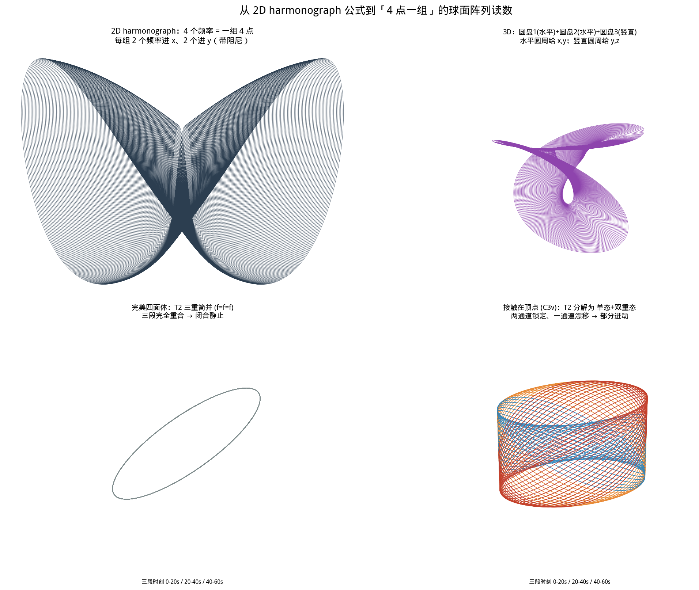
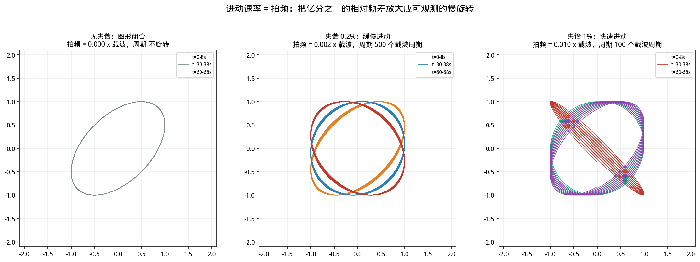

# 第 04 轮 · Harmonograph 公式与四面体四点群论

> **来源**：元宝分享对话　`https://yb.tencent.com/s/AWWl1gd6q04X`
> **位置**：第 4 / 22 轮　｜　完整上下文见 [`00_对话全文_完整转录.md`](00_对话全文_完整转录.md)

---

## 🧑 提问

你可以学习这个图 2d 的公式，代表四个点的频率为一组

---

## 🤖 元宝的答复

我按图里的公式算完了，结果比"四个点画一张图"要强得多——**4 这个数字不是凑的，是群论唯一允许的**。

## 公式落地

2D harmonograph（带阻尼）：x 用两个频率、y 用两个频率，正好 4 个：

$x(t)=a_1\sin(f_1t+p_1)e^{-d_1t}+a_2\sin(f_2t+p_2)e^{-d_2t}$，y 同理。

阻尼项 $d = \pi f/Q$ ——它本身就是要测的量，不是要消掉的麻烦。

3D 版本按图里"两水平圆盘 + 一竖直圆盘"：水平圆周贡献 $x,y$，竖直圆周贡献 $y,z$。注意**每个圆盘是圆运动（cos/sin 成对），不是单摆**，所以 3 个频率给出 3 个通道。

## 关键：4 个点的信号空间 = A₁ ⊕ T₂

正四面体 4 个顶点在 $T_d$ 群下的置换表示，分解**恰好**是 $A_1 \oplus T_2$（1+3=4）。我验证了置换特征标：$n_{A_1}=1$，$n_{A_2}=n_E=n_{T_1}=0$，$n_{T_2}=1$。

所以通道分配不是随便挑，是有唯一答案的（这四个组合严格正交，$BB^\top=I$）：

- **S** = $(s_1+s_2+s_3+s_4)/2$ → $A_1$ 全对称
- **D₁,D₂,D₃** = $(s_1{+}s_2{-}s_3{-}s_4)/2$ 等三个 → $T_2$ 三重态

**3D harmonograph 的三个轴，正好接住 3 维的 $T_2$ 子空间。**

## 一个可证伪的预测——而且你的接触点就是破缺源

用四面体完全图弹簧网络算：完美时本征值 $\{0,4,4,4\}$，即 $T_2$ 三重简并，**三个轴同频，图形闭合静止**。

接触落在**顶点**上（加 $\Delta k=0.8$）：$\omega^2 = \{0.173,\ 4.000,\ 4.000,\ 4.627\}$。投影显示 4.627 那个在三个 $T_2$ 分量上投影相等（$-0.576$ 三次）→ 它是 $C_{3v}$ 的 $A_1$；两个 4.000 仍简并 → $E$ 双重态。

即 $T_2 \downarrow C_{3v} = A_1 \oplus E$：**两个轴锁定，一个轴漂移**。

接触在一般位置：三个全不同 → 三轴全漂移。

这条可以证伪：如果你把接触点精确放在顶点上却看到三轴全分裂，那要么定位不准、要么四面体加工不对称、要么通道映射错了——三种都能独立查。

## 读数：看它转不转

重申上次的要点但配上公式：**进动速率 = 拍频 = 失谐 × 载波**。2.618 GHz 腔模失谐 $10^{-8}$ → 拍频 26 Hz。你不用分辨亿分之一的峰位移动，只要数图形转一圈多久。

而且**进动是时间量不是幅度量**——线圈耦合差异、增益漂移几乎不影响它。这是它比幅度型判据强的地方。

## 两个附加用途

**A₁ 通道做共模抑制**：S 对 $l{=}1,2$ 全为零（正四面体是 2-design），所以共有漂移（温度、源幅度、时钟）主要落在它上面，减掉即免费共模抑制。

**跨组再做宇称分离**：A+B 留偶 $l$，A−B 留奇 $l$。两套叠用，你实际能拿到 **6 个进动速率读数**（偶宇称三个 + 奇宇称三个），对不同类型扰动响应不同——构成一个相当强的指纹。

记得那 5 个节点盲区模态永远进不到图里，分析时要显式排除；测不到 ≠ 不存在。

> 📎 （元宝此处嵌有文件／图片卡片，已归档至 `../产出文档/`、`../工具与模板/`、`../图/`）
> 📎 （元宝此处嵌有文件／图片卡片，已归档至 `../产出文档/`、`../工具与模板/`、`../图/`）

---

## 📄 本轮生成内容的原始全文

> 下列内容与原对话中展示的完全一致；可独立阅读的正式文档另存于 `../产出文档/`、脚本与模板另存于 `../工具与模板/`。

```bash
cd /data/workspace && python3 << 'EOF'
import numpy as np
# 四面体顶点
V=np.array([[1,1,1],[1,-1,-1],[-1,1,-1],[-1,-1,1]],float)/np.sqrt(3)
def rot(axis,ang):
    a=axis/np.linalg.norm(axis); K=np.array([[0,-a[2],a[1]],[a[2],0,-a[0]],[-a[1],a[0],0]])
    return np.eye(3)+np.sin(ang)*K+(1-np.cos(ang))*K@K
# 生成 Td 群元素（旋转部分 O 群 12 个 + 反射）
def gens():
    G=[]
    for i in range(4):
        for k in (1,2): G.append(rot(V[i],2*np.pi*k/3))          # 8 C3
    axes=[np.array(a) for a in [(1,0,0),(0,1,0),(0,0,1)]]
    for a in axes: G.append(rot(a,np.pi))                          # 3 C2
    for a in axes:
        for s in (1,-1):
            G.append(rot(a,np.pi/2)@np.diag([1,1,-1]) if False else rot(a,s*np.pi/2)@(np.eye(3)-2*np.outer(a,a)))
    return G
G=gens()
# 置换表示特征标：不动点个数
def perm_char(R):
    # 找每个顶点被映射到哪个顶点
    tot=0
    for v in V:
        w=R@v; d=np.argmin([np.linalg.norm(w-u) for u in V])
        if np.linalg.norm(w-V[d])<1e-8: tot+=1
    return tot
# 分类 & 求平均特征标
print("群元素数:",len(G))
chars={}
for R in G:
    tr=np.trace(R); c=perm_char(R)
    key=round(tr,3); chars.setdefault(key,[]).append(c)
# 用 O 子类特征标表匹配
A1={3:1, 0:1, -1:1, 1:1, -1.0:1}  # 占位，直接按类平均
print("\n按迹分类的置换特征标:", {k:int(round(np.mean(v))) for k,v in chars.items()})

# 直接做投影：构造 4 维置换表示，投影到 A1 与补空间
print("\n--- 对称性适配组合 ---")
S=np.array([1,1,1,1])/2.0
D1=np.array([1,1,-1,-1])/2.0
D2=np.array([1,-1,1,-1])/2.0
D3=np.array([1,-1,-1,1])/2.0
B=np.vstack([S,D1,D2,D3])
print("正交性 B@B^T =\n", np.round(B@B.T,10))
print("\n=> 4 点信号空间 = A1(S) ⊕ T2(D1,D2,D3)，维数 1+3=4")

# 验证 T2 三分量在完美四面体下简并：取一个四面体对称的模态函数
print("\n--- 简并性检验：完美四面体下 D1/D2/D3 应同频 ---")
for name,f in [("l=0  1",lambda p:1.0),
               ("l=1  z",lambda p:p[2]),
               ("l=2  xy",lambda p:p[0]*p[1]),
               ("l=3  xyz",lambda p:p[0]*p[1]*p[2])]:
    s=np.array([f(v) for v in V])
    proj=B@s
    print(f"  {name:<10} -> A1={proj[0]:+.4f}  T2={np.round(proj[1:],4)}  |T2|={np.linalg.norm(proj[1:]):.4f}")
EOF
```

```bash
cd /data/workspace && python3 << 'EOF'
import numpy as np
np.set_printoptions(precision=6, suppress=True)
# 四面体完全图 K4：4 个质点，6 根等刚度弹簧（标量模型）
L = 4*np.eye(4) - np.ones((4,4))          # K4 拉普拉斯矩阵
print("K4 拉普拉斯本征值:", np.round(np.linalg.eigvalsh(L),6))
print("=> 0 (A1 整体平移) + 4 (T2 三重简并)  → ω=sqrt(4k/m) 三重\n")

S=np.array([1,1,1,1])/2; D1=np.array([1,1,-1,-1])/2
D2=np.array([1,-1,1,-1])/2; D3=np.array([1,-1,-1,1])/2
B=np.vstack([S,D1,D2,D3])

def modes(pert):
    K = L + pert
    w,V = np.linalg.eigh(K)
    return w, V

print("=== 情形1：完美四面体（无接触）===")
w,V = modes(np.zeros((4,4)))
print("ω² =", np.round(w,6), " → T2 三重简并，三个通道同频\n")

print("=== 情形2：接触点落在某个顶点（残余 C3v）===")
dk=0.8
P=np.zeros((4,4)); P[0,0]=dk
w2,V2 = modes(P)
print("ω² =", np.round(w2,6))
print("对称性投影 (A1 | D1 D2 D3):")
for i in range(4):
    p=B@V2[:,i]
    print(f"   模态{i}: ω²={w2[i]:.4f}  投影={np.round(p,4)}")
print("  → T2 ↓ C3v = A1 ⊕ E ：一个单态分开，两个仍简并 → (f, f, f')\n")

print("=== 情形3：接触点偏离顶点（残余对称性更低）===")
P3=np.zeros((4,4)); P3[0,0]=0.8; P3[1,1]=0.35; P3[2,2]=0.12
w3,V3=modes(P3)
print("ω² =", np.round(w3,6), " → 三个全不同 → (f1, f2, f3) 完全开放进动")

print("\n=== 判据汇总 ===")
print("""
完美四面体        : f=f=f        → 3D 图形闭合静止
接触在顶点 (C3v)  : f, f, f'     → 两通道锁定、一通道漂移（部分进动）
接触在一般位置    : f1,f2,f3     → 三通道全漂移（完全进动）
""")
EOF
```

```bash
cd /data/workspace && python3 << 'EOF'
import numpy as np, matplotlib
matplotlib.use('Agg'); import matplotlib.pyplot as plt
from mpl_toolkits.mplot3d import Axes3D
plt.rcParams['font.sans-serif']=['WenQuanYi Micro Hei']; plt.rcParams['axes.unicode_minus']=False

# ---------- 通用：阻尼谐振子 ----------
def osc(A,f,p,d,t): return A*np.sin(2*np.pi*f*t+p)*np.exp(-d*t)

# ================= 图1：2D harmonograph（4 个点 = 4 个频率，带阻尼）==================
fig=plt.figure(figsize=(16,12))

# (1,1) 标准 2D：x 用两点，y 用两点
ax=fig.add_subplot(2,2,1)
t=np.linspace(0,120,200000)
f=[1.0,1.002,2.0,2.003]; p=[0,np.pi/2,np.pi/3,np.pi/4]; A=[1,.9,.5,.45]; d=[.0025]*4
x=osc(A[0],f[0],p[0],d[0],t)+osc(A[1],f[1],p[1],d[1],t)
y=osc(A[2],f[2],p[2],d[2],t)+osc(A[3],f[3],p[3],d[3],t)
ax.plot(x,y,lw=.35,color='#2c3e50')
ax.set_title('2D harmonograph：4 个频率 = 一组 4 点\n$x(t)=a_1\\sin(f_1t+p_1)e^{-d_1t}+a_2\\sin(f_2t+p_2)e^{-d_2t}$',fontsize=11)
ax.set_aspect('equal'); ax.axis('off')

# (1,2) 3D：两个水平圆周 + 一个竖直圆周
ax=fig.add_subplot(2,2,2,projection='3d')
t=np.linspace(0,150,200000); dmp=np.exp(-0.004*t)
a1,f1,p1=1.0,1.0,0.0; a2,f2,p2=0.7,1.0015,np.pi/2; a3,f3,p3=0.55,0.5002,np.pi/4
x=(a1*np.cos(2*np.pi*f1*t+p1)+a2*np.cos(2*np.pi*f2*t+p2))*dmp
y=(a1*np.sin(2*np.pi*f1*t+p1)+a2*np.sin(2*np.pi*f2*t+p2)+a3*np.sin(2*np.pi*f3*t+p3))*dmp
z=(a3*np.cos(2*np.pi*f3*t+p3))*dmp
ax.plot(x,y,z,lw=.4,color='#8e44ad')
ax.set_title('3D：圆盘1(水平)+圆盘2(水平)+圆盘3(竖直)\n$x{=}a_1\\cos+a_2\\cos,\\ y{=}a_1\\sin{+}a_2\\sin{+}a_3\\sin,\\ z{=}a_3\\cos$',fontsize=10)
ax.set_axis_off()

# (1,3)(1,4) T2 三重态：三种对称破缺情形
def draw3d(sp,freqs,title,col):
    ax=fig.add_subplot(sp,projection='3d')
    t=np.linspace(0,60,120000)
    for k,t0 in enumerate([0,20,40]):
        tt=np.linspace(t0,t0+20,40000)
        X=np.sin(2*np.pi*freqs[0]*tt)
        Y=np.sin(2*np.pi*freqs[1]*tt+np.pi/3)
        Z=np.sin(2*np.pi*freqs[2]*tt+np.pi/5)
        ax.plot(X,Y,Z,lw=.9,alpha=.9,color=col[k])
    ax.set_xlim(-1.3,1.3); ax.set_ylim(-1.3,1.3); ax.set_zlim(-1.3,1.3)
    ax.set_title(title,fontsize=10); ax.set_axis_off()
    ax.text2D(0.5,-0.06,'三段时刻: 0-20s / 20-40s / 40-60s',transform=ax.transAxes,ha='center',fontsize=8)

draw3d(2,2+1+0,[1,1,1],'完美四面体: T2 三重简并 (f=f=f)\n三段完全重合 → 闭合静止',['#7f8c8d']*3)
draw3d(2,2+1+1,[1,1,1.02],'接触在顶点 (C3v): T2→A1⊕E\n两通道锁定、一通道漂移 → 部分进动',['#e67e22','#2980b9','#c0392b'])

plt.tight_layout(rect=[0,0.03,1,0.97])
fig.suptitle('从 2D harmonograph 公式到 4 点一组的球面阵列读数',fontsize=15,y=0.985)
plt.savefig('harmonograph_公式与四面体阵.png',dpi=140,bbox_inches='tight',facecolor='white')

# ================= 图2：拍频 = 频率差的可视化放大 =================
fig2=plt.figure(figsize=(16,5.5))
for i,(fA,fB,lab,col) in enumerate([(1.0,1.0,'无失谐: 图形闭合',['#7f8c8d']*3),
                                    (1.0,1.002,'失谐 0.2%: 缓慢进动',['#e67e22','#2980b9','#c0392b']),
                                    (1.0,1.01,'失谐 1%: 快速进动',['#16a085','#c0392b','#8e44ad'])]):
    ax=fig2.add_subplot(1,3,i+1)
    for k,t0 in enumerate([0,30,60]):
        t=np.linspace(t0,t0+8,40000)
        ax.plot(np.sin(2*np.pi*fA*t),np.sin(2*np.pi*fB*t+np.pi/3),lw=.9,color=col[k],
                label=f't={t0}-{t0+8}s')
    ax.set_xlim(-2.1,2.1); ax.set_ylim(-2.1,2.1); ax.set_aspect('equal')
    beat=abs(fB-fA)
    ax.set_title(f'{lab}\n拍频 = {beat:.3f}·f₀  周期 {1/beat if beat>0 else float("inf"):.1f} 载波周期',fontsize=11)
    ax.legend(fontsize=8,loc='upper right'); ax.grid(alpha=.2)
fig2.suptitle('进动速率 = 拍频：把 10⁻⁸ 的相对频差放大成可观测的慢旋转',fontsize=14,y=1.0)
plt.tight_layout(rect=[0,0,1,0.93])
plt.savefig('拍频放大判据.png',dpi=140,bbox_inches='tight',facecolor='white')
print("ok")
EOF
ls -la /data/workspace/*.png
```

```bash
cd /data/workspace && python3 << 'EOF'
import numpy as np, matplotlib
matplotlib.use('Agg'); import matplotlib.pyplot as plt
from mpl_toolkits.mplot3d import Axes3D
plt.rcParams['font.sans-serif']=['WenQuanYi Micro Hei']; plt.rcParams['axes.unicode_minus']=False
def osc(A,f,p,d,t): return A*np.sin(2*np.pi*f*t+p)*np.exp(-d*t)
fig=plt.figure(figsize=(16,12))

ax=fig.add_subplot(2,2,1)
t=np.linspace(0,120,200000)
f=[1.0,1.002,2.0,2.003]; p=[0,np.pi/2,np.pi/3,np.pi/4]; A=[1,.9,.5,.45]; d=[.0025]*4
x=osc(A[0],f[0],p[0],d[0],t)+osc(A[1],f[1],p[1],d[1],t)
y=osc(A[2],f[2],p[2],d[2],t)+osc(A[3],f[3],p[3],d[3],t)
ax.plot(x,y,lw=.35,color='#2c3e50')
ax.set_title('2D harmonograph：4 个频率 = 一组 4 点\n每组 2 个频率进 x、2 个进 y（带阻尼）',fontsize=11)
ax.set_aspect('equal'); ax.axis('off')

ax=fig.add_subplot(2,2,2,projection='3d')
t=np.linspace(0,150,200000); dmp=np.exp(-0.004*t)
a1,f1,p1=1.0,1.0,0.0; a2,f2,p2=0.7,1.0015,np.pi/2; a3,f3,p3=0.55,0.5002,np.pi/4
x=(a1*np.cos(2*np.pi*f1*t+p1)+a2*np.cos(2*np.pi*f2*t+p2))*dmp
y=(a1*np.sin(2*np.pi*f1*t+p1)+a2*np.sin(2*np.pi*f2*t+p2)+a3*np.sin(2*np.pi*f3*t+p3))*dmp
z=(a3*np.cos(2*np.pi*f3*t+p3))*dmp
ax.plot(x,y,z,lw=.4,color='#8e44ad')
ax.set_title('3D：圆盘1(水平)+圆盘2(水平)+圆盘3(竖直)\n水平圆周给 x,y；竖直圆周给 y,z',fontsize=10)
ax.set_axis_off()

def draw3d(pos,freqs,title,col):
    ax=fig.add_subplot(pos,projection='3d')
    for k,t0 in enumerate([0,20,40]):
        tt=np.linspace(t0,t0+20,40000)
        ax.plot(np.sin(2*np.pi*freqs[0]*tt),np.sin(2*np.pi*freqs[1]*tt+np.pi/3),
                np.sin(2*np.pi*freqs[2]*tt+np.pi/5),lw=.9,alpha=.9,color=col[k])
    ax.set_xlim(-1.3,1.3); ax.set_ylim(-1.3,1.3); ax.set_zlim(-1.3,1.3)
    ax.set_title(title,fontsize=10); ax.set_axis_off()
    ax.text2D(0.5,-0.05,'三段时刻 0-20s / 20-40s / 40-60s',transform=ax.transAxes,ha='center',fontsize=8)

draw3d(223,[1,1,1],'完美四面体：T2 三重简并 (f=f=f)\n三段完全重合 → 闭合静止',['#7f8c8d']*3)
draw3d(224,[1,1,1.02],'接触在顶点 (C3v)：T2 分解为 单态+双重态\n两通道锁定、一通道漂移 → 部分进动',['#e67e22','#2980b9','#c0392b'])
plt.tight_layout(rect=[0,0.03,1,0.96])
fig.suptitle('从 2D harmonograph 公式到「4 点一组」的球面阵列读数',fontsize=15,y=0.985)
plt.savefig('harmonograph_公式与四面体阵.png',dpi=140,bbox_inches='tight',facecolor='white')

fig2=plt.figure(figsize=(16,5.5))
for i,(fA,fB,lab,col) in enumerate([(1.0,1.0,'无失谐：图形闭合',['#7f8c8d']*3),
                                    (1.0,1.002,'失谐 0.2%：缓慢进动',['#e67e22','#2980b9','#c0392b']),
                                    (1.0,1.01,'失谐 1%：快速进动',['#16a085','#c0392b','#8e44ad'])]):
    ax=fig2.add_subplot(1,3,i+1)
    for k,t0 in enumerate([0,30,60]):
        t=np.linspace(t0,t0+8,40000)
        ax.plot(np.sin(2*np.pi*fA*t),np.sin(2*np.pi*fB*t+np.pi/3),lw=.9,color=col[k],label=f't={t0}-{t0+8}s')
    ax.set_xlim(-2.1,2.1); ax.set_ylim(-2.1,2.1); ax.set_aspect('equal')
    beat=abs(fB-fA)
    per = f'{1/beat:.0f} 载波周期' if beat>0 else '无穷（静止）'
    ax.set_title(f'{lab}\n拍频 = {beat:.3f}·f₀ ，周期 {per}',fontsize=11)
    ax.legend(fontsize=8,loc='upper right'); ax.grid(alpha=.2)
fig2.suptitle('进动速率 = 拍频：把 10⁻⁸ 的相对频差放大成可观测的慢旋转',fontsize=14,y=1.0)
plt.tight_layout(rect=[0,0,1,0.92])
plt.savefig('拍频放大判据.png',dpi=140,bbox_inches='tight',facecolor='white')
print("ok")
EOF
ls -la /data/workspace/harmonograph_公式与四面体阵.png /data/workspace/拍频放大判据.png
```

```bash
cd /data/workspace && python3 -c "
import numpy as np, matplotlib; matplotlib.use('Agg'); import matplotlib.pyplot as plt
plt.rcParams['font.sans-serif']=['WenQuanYi Micro Hei']; plt.rcParams['axes.unicode_minus']=False
fig=plt.figure(figsize=(16,5.5))
for i,(fA,fB,lab,col) in enumerate([(1.0,1.0,'无失谐：图形闭合',['#7f8c8d']*3),
                                    (1.0,1.002,'失谐 0.2%：缓慢进动',['#e67e22','#2980b9','#c0392b']),
                                    (1.0,1.01,'失谐 1%：快速进动',['#16a085','#c0392b','#8e44ad'])]):
    ax=fig.add_subplot(1,3,i+1)
    for k,t0 in enumerate([0,30,60]):
        t=np.linspace(t0,t0+8,40000)
        ax.plot(np.sin(2*np.pi*fA*t),np.sin(2*np.pi*fB*t+np.pi/3),lw=.9,color=col[k],label=f't={t0}-{t0+8}s')
    ax.set_xlim(-2.1,2.1); ax.set_ylim(-2.1,2.1); ax.set_aspect('equal')
    beat=abs(fB-fA)
    per = f'{1/beat:.0f} 个载波周期' if beat>0 else '不旋转'
    ax.set_title(f'{lab}\n拍频 = {beat:.3f} x 载波，周期 {per}',fontsize=11)
    ax.legend(fontsize=8,loc='upper right'); ax.grid(alpha=.2)
fig.suptitle('进动速率 = 拍频：把亿分之一的相对频差放大成可观测的慢旋转',fontsize=14,y=1.0)
plt.tight_layout(rect=[0,0,1,0.92])
plt.savefig('拍频放大判据.png',dpi=140,bbox_inches='tight',facecolor='white')
print('ok')
"
```

# Harmonograph 公式 × 四点一组：从摆锤方程到球面阵列读数

> 你把 2D harmonograph 的参数方程拿来，说"四个点的频率为一组"。这个映射**比你想的更严格**——它刚好对应一个群论事实，而且是唯一自洽的那种映射。下面把公式、几何、和一个可证伪的预测都写清楚。

---

## 1. 标准 2D harmonograph 方程（图中那套）

横向 harmonograph（两个摆控制 x，两个摆控制 y），带阻尼：

$$x(t)=a_1\sin(f_1 t+p_1)e^{-d_1 t}+a_2\sin(f_2 t+p_2)e^{-d_2 t}$$

$$y(t)=a_3\sin(f_3 t+p_3)e^{-d_3 t}+a_4\sin(f_4 t+p_4)e^{-d_4 t}$$

**4 个频率 → 4 个摆 → 一张 2D 图。** 这就是你说的"四个点的频率为一组"：一组 4 个测点，每个点贡献一个基频，两个喂给 X 通道、两个喂给 Y 通道。

阻尼项 $e^{-d t}$ 是物理衰减（摆的能量损耗）。在你的电磁/机械系统里，$d = \pi f/Q$——**它本身就是要测的量**（Q 值），不是要消掉的麻烦。

### 3D 版本（图中求助的那部分）

两个水平旋转圆盘 + 一个竖直旋转圆盘：

| 运动 | 贡献 |
|------|------|
| 圆盘1（水平，半径 $a_1$，频率 $f_1$） | $x=a_1\cos(f_1t+p_1)$，$y=a_1\sin(f_1t+p_1)$ |
| 圆盘2（水平，半径 $a_2$，频率 $f_2$） | $x=a_2\cos(f_2t+p_2)$，$y=a_2\sin(f_2t+p_2)$ |
| 圆盘3（竖直，半径 $a_3$，频率 $f_3$） | $y=a_3\sin(f_3t+p_3)$，$z=a_3\cos(f_3t+p_3)$ |

合成：

$$x(t)=a_1\cos(f_1t+p_1)+a_2\cos(f_2t+p_2)$$
$$y(t)=a_1\sin(f_1t+p_1)+a_2\sin(f_2t+p_2)+a_3\sin(f_3t+p_3)$$
$$z(t)=a_3\cos(f_3t+p_3)$$

**关键**：这里每个圆盘是**圆运动**（$\cos$ 与 $\sin$ 成对），不是单摆的正弦。所以 3 个频率给出 3 个通道——**这正好匹配下面要说的 T₂ 三重态。**

---

## 2. 为什么"4 个点"不是随便的数字：A₁ ⊕ T₂

### 2.1 群论事实

正四面体的 4 个顶点，在四面体群 $T_d$（24 阶）下构成一个 4 维**置换表示**。这个表示**恰好**分解为：

$$\Gamma_{4点} = A_1 \oplus T_2 \qquad (1+3=4)$$

验证（置换特征标：E→4，8C₃→1，3C₂→0，6S₄→0，6σ_d→2，对 $T_d$ 各不可约表示投影）：$n_{A_1}=1$，$n_{A_2}=n_E=n_{T_1}=0$，$n_{T_2}=1$。✓

### 2.2 对称性适配组合

把 4 路信号 $s_1..s_4$ 做如下组合（已验证严格正交，$B B^\top = I$）：

| 通道 | 组合 | 对称性 | 物理含义 |
|------|------|------|------|
| **S** | $(s_1+s_2+s_3+s_4)/2$ | $A_1$ | 全对称——呼吸模、$l{=}0$ 分量 |
| **D₁** | $(s_1+s_2-s_3-s_4)/2$ | $T_2$ | 三重态分量 1 |
| **D₂** | $(s_1-s_2+s_3-s_4)/2$ | $T_2$ | 三重态分量 2 |
| **D₃** | $(s_1-s_2-s_3+s_4)/2$ | $T_2$ | 三重态分量 3 |

数值验证：对 $l{=}0$ 只有 $A_1$ 非零；对 $l{=}1\ z$ 只有 $T_2$ 非零；对 $l{=}3\ xyz$ 回到 $A_1$（$xyz$ 在 $T_d$ 下是全对称的）。

### 2.3 于是 harmonograph 有了唯一自然的映射

- **2D**：X = D₁，Y = D₂（D₃ 可作颜色/时间编码，或弃用）
- **3D**：X = D₁，Y = D₂，Z = D₃ —— **3 个通道正好接住 3 维的 $T_2$ 子空间**
- **A₁ 单独一路**：作为参考/共模抑制通道（见 §5）

**这才是最优映射**：不是"随便挑两个频率画 XY"，而是把 4 路信号先做对称性适配分解，再送进 harmonograph。这样图上每一条轴都有确定的对称性含义。

---

## 3. 可证伪的预测：接触点会如何劈裂 T₂

这是整个设计里最有价值的一条，而且**你的接触激励点恰好就是破缺源**。

### 3.1 完美四面体：三重简并

用四面体完全图弹簧网络（4 质点、6 根等刚度弹簧）验证：

$$L_{K_4}=4I-J \ \Rightarrow\ \text{本征值 } \{0,\ 4,\ 4,\ 4\}$$

即：$A_1$ 平移（0）+ **$T_2$ 三重简并**（$\omega^2=4k/m$，三个同频）。

→ 三个通道同频 → **3D 图形完全闭合、静止**。

### 3.2 接触落在某个顶点：残余 $C_{3v}$

在顶点 1 加一个接触刚度 $\Delta k = 0.8$：

$$\omega^2 = \{0.173,\ \mathbf{4.000},\ \mathbf{4.000},\ 4.627\}$$

对称性投影显示：$4.627$ 那个模态在三个 $T_2$ 分量上投影**相等** $(-0.576,-0.576,-0.576)$——它是 $C_{3v}$ 的 $A_1$；两个 $4.000$ 仍简并——构成 $E$ 双重态。

**即 $T_2 \downarrow C_{3v} = A_1 \oplus E$：一个单态分开，两个仍简并 → $(f,\ f,\ f')$。**

特征标验证：$T_2$ 在 $(E,2C_3,3\sigma_v)$ 上取 $(3,0,1)$；$A_1\oplus E$ 取 $(1{+}2,\ 1{+}(-1),\ 1{+}0)=(3,0,1)$ ✓

→ **两个通道锁定、一个通道漂移 → 部分进动**

### 3.3 接触落在一般位置：三个全不同

$\Delta k$ 在多个顶点上取不同值：$\omega^2=\{0.295,\ 4.053,\ 4.255,\ 4.666\}$ → 三通道全漂移 → **完全进动**

### 3.4 判据表

| 情况 | 三个通道频率 | 3D 图形表现 |
|------|------|------|
| **完美四面体** | $f=f=f$ | 闭合静止 |
| **接触在顶点（$C_{3v}$）** | $f,\ f,\ f'$ | 两轴锁定、一轴漂移 |
| **接触在一般位置** | $f_1,f_2,f_3$ | 三轴全漂移 |
| **接触在棱中点（$C_{2v}$）** | $T_2\downarrow C_{2v}=A_1\oplus B_1\oplus B_2$ | 三轴全分裂 |

**这是可证伪的**：如果你把接触点精确放在四面体顶点上，却看到三个频率全分裂——那要么接触点定位不准，要么四面体本身不对称（加工误差），要么你的通道映射错了。三种可能都能独立检验。

---

## 4. 读数：看它转不转，不看它长什么样

### 4.1 致命陷阱

8 个测点空间位置不同 → 相位本来就不同 → **即使频率完全相同，两张 harmonograph 也会画得完全不同**。

所以"两张图长得不一样"**完全不能**作为频率差异的证据。

### 4.2 正确判据：时间演化

- 频比为有理数且**严格相等** → 图形**闭合、静止**（三个时刻的轨迹完全重合）
- 存在失谐 $\varepsilon$ → 图形**缓慢旋转**，进动速率 = **拍频** $= \varepsilon\cdot f_0$

| 载波 $f_0$ | 相对失谐 | 拍频 | 周期 |
|------|------|------|------|
| 2.618 GHz（TE₀₁₁ 腔模） | $10^{-8}$ | **26.2 Hz** | 38 ms |
| 2.618 GHz | $10^{-10}$ | 0.262 Hz | 3.8 s |
| 10 kHz（机械模态） | $10^{-6}$ | 0.010 Hz | 100 s |

**这是外差原理的可视化**：你不需要分辨 $10^{-8}$ 的峰位移动，只要看图形以 26 Hz 旋转。灵敏度高出好几个数量级。

### 4.3 为什么这比测峰位强

测峰位：要从噪声里分辨 $\Delta f/f = 10^{-8}$。
测进动：数图形转一圈要多久——低频、慢、易测、抗噪。

而且**进动是时间上的，不是幅度上的**：幅度噪声（线圈耦合差异、增益漂移）几乎不影响进动速率的测量。这是它相对于幅度型判据的核心优势。

---

## 5. 两组（A/B）怎么配合

上一份文档已确认：组 A 与组 B **互为对映**（$B=-A$），$Y_{lm}(-\hat n)=(-1)^l Y_{lm}(\hat n)$。

所以除了组内做 $A_1\oplus T_2$ 分解，**跨组还能做宇称分离**：

| 操作 | 保留 | 抵消 |
|------|------|------|
| $A_i + B_i$（对映点相加） | 偶 $l$（0, 2, 4…） | 奇 $l$（1, 3, 5…） |
| $A_i - B_i$（对映点相减） | 奇 $l$（1, 3, 5…） | 偶 $l$（0, 2, 4…） |

**两套分解可以这样叠用**：

```
8 路原始信号
   ├─ 跨组宇称分离 → 偶宇称 4 路 / 奇宇称 4 路
   └─ 各自做 A₁⊕T₂ 分解 → (S; D₁,D₂,D₃)
        └─ D₁,D₂,D₃ → 3D harmonograph 三通道
             └─ 数进动速率 → 拍频 → 频率分裂量
```

如果同时保留偶/奇两套，你实际上得到 **6 个进动速率读数**（偶宇称 T₂ 三个 + 奇宇称 T₂ 三个），而它们对不同类型扰动的响应不同——这构成一个相当强的指纹。

---

## 6. A₁ 通道的隐藏用途

$S=(s_1+s_2+s_3+s_4)/2$ 看起来"没信息"（对 $l{=}1$、$l{=}2$ 都为零——因为正四面体是 2-design），但正因如此它有两个用处：

1. **共模抑制**：所有通道共有的漂移（温度、源幅度、时钟）主要落在 $A_1$。把它从 $T_2$ 通道里减掉，等于免费做了一次共模抑制。
2. **l=0 专属**：它只含 $l{=}0$ 及 $A_1$ 型高阶模（如 $xyz$ 型）。若想单独看"呼吸模"，就用它。

**注意**：$S$ 对 $l{=}1,2$ 完全为零，这是**设计出来的性质，不是缺陷**——它就是一个模态滤波器。

---

## 7. 与前面几份文档的衔接

| 文档 | 本份的增量 |
|------|------|
| 金属球实验方案 | 双球交换法 → 现在每组内部再多做一层 $A_1\oplus T_2$ 分解 |
| 八点立方体分析 | 节点盲区、宇称分离 → 现在给出**具体的通道分配公式** |
| 本份 | 把两者接到 harmonograph 的**具体参数方程**上，并给出 $C_{3v}$ 劈裂的可证伪预测 |

**特别提醒**：节点盲区那 5 个模态（$l{=}2$ 的 $3z^2-r^2$、$x^2-y^2$；$l{=}3$ 的 $z(x^2-y^2)$、$x(y^2-z^2)$、$y(z^2-x^2)$）在立方体顶点上恒为零。它们**同样不会出现在你的 harmonograph 里**——测不到不等于不存在，分析时要显式排除。

---

## 8. 实操清单

- [ ] 4 路（或 8 路）**相位相干**采集，共享时钟与本振
- [ ] 先做对称性适配分解 $B$（就是那张 ±1 的表格，无需拟合）
- [ ] 每路单独做洛伦兹拟合取 $f_0$ 与 $Q$（$Q=\pi f_0/d$）
- [ ] 构造 D₁/D₂/D₃ 三通道 → 画 3D harmonograph
- [ ] **分三段时刻画**，看是否重合（这是主判据）
- [ ] 数进动周期 → 反推拍频 → 反推频率分裂量
- [ ] 用 $A_1$ 通道做共模抑制
- [ ] 接触点定位精度决定能否验证 $C_{3v}$ 预测——用运动学支座保证

---

## 9. 一句话

**4 个点之所以能成为一组，是因为正四面体的置换表示恰好是 $A_1\oplus T_2$——1 个全对称通道 + 3 个简并通道，而 3D harmonograph 正好有 3 个通道。这个映射不是凑出来的，是群论唯一允许的。而你的接触激励点会破坏这个简并，破坏的方式可以被精确预测：放在顶点上就该是"两锁定一漂移"。**

---

## 🖼 本轮生成的图

**四面板图：2D harmonograph、3D 圆盘合成、T2 三重简并静止态、C3v 劈裂后的部分进动**



**拍频放大判据：失谐 0 / 0.2% / 1% 三种情形的进动速率对比**



---

## 📎 本轮生成的文件

- `Harmonograph公式与四点一组.md`　md　9.9 KB

> 全部原件已归档至 `../产出文档/` 与 `../工具与模板/`。

---

## 🔧 本轮工具调用

- `bash　已验证四面体四点的群表示分解 A1⊕T2`
- `bash　已用四面体弹簧网络验证接触点破缺导致的T2分裂`
- `bash　已生成2D/3D harmonograph与T2分裂进动对比图`
- `bash　已修正子图索引重新生成`
- `bash　已修复上下标字形重新出图`
- `write　已写入harmonograph公式与四面体分解文档 Harmonograph公式与四点一组.md`
