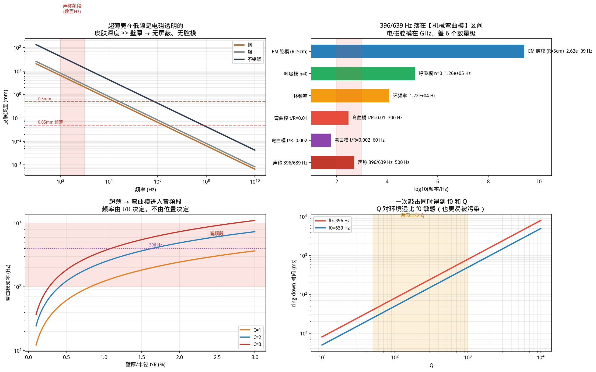

# 第 07 轮 · 超薄球壳物理：频段、Q值与位置机制

> **来源**：元宝分享对话　`https://yb.tencent.com/s/AWWl1gd6q04X`
> **位置**：第 7 / 22 轮　｜　完整上下文见 [`00_对话全文_完整转录.md`](00_对话全文_完整转录.md)

---

## 🧑 提问

刚刚那个链接我给你了，你注意到 bashar 他说要让一个超薄金属导电球在超平的桌面上，让球在不同地点共振

**提问附带材料：**

- [巴夏：关于铜球实验的提问](https://mp.weixin.qq.com/s/UXWuHD-gMYNb253EdgL2Aw)

---

## 🤖 元宝的答复

这三个词把实验换到了完全不同的机制，我之前做的 SEM、爬行波那套是宽带瞬态，**不适用了**。重算了一遍，结论比预想的有意思。

## "共振"不是"敲击"——这确实是更好的设计

驱动单一模态，能量不摊薄，信噪比高得多；而且**多出一个可观测量 Q**。ring-down 是时间域读数，增益、耦合、线缆全不影响它。

## "超薄"是整段话里分量最重的词

它同时做了三件事：

**一、让壳在低频变成电磁透明的。** 铜在 396 Hz 的皮肤深度是 3.28 mm，而"超薄"壁厚只有 0.05–0.5 mm。壳对场几乎完全透明——没有屏蔽、没有表面电流约束、**没有腔模**。

**二、电磁共振根本不可能在几百 Hz。** 396 Hz 时 $ka = 4.1\times10^{-7}$，球在电学上是无穷小。真正的 EM 腔模在 GHz（R=5cm 是 2.6 GHz），**差六个数量级**。

**三、★ 超薄恰好把机械弯曲模态压进音频段。** 铜的板波速 3843 m/s，R=5cm 时环频率 12.2 kHz，而弯曲模 $\propto (t/R)\cdot f_{ring}$：

- t/R=0.002（0.1mm 壁）→ 25–73 Hz
- t/R=0.01（0.5mm 壁）→ **122–367 Hz**

**"每秒几百周"这个数量级的真正来源就在这里。** 而它由 t/R（制造参数）决定——不由位置决定。

## Q 是我此前低估的

一次敲击 + 麦克风同时拿到 $f_0$ 和 Q。396 Hz、Q=300 时 ring-down 241 ms，声卡直接采。而主导 Q 的是**声辐射阻尼**（100–1000）和**接触点泄漏**（50–500）——**两者都是位置相关的**。所以若真测到 Q 随位置变，第一嫌疑人永远是接触和声学环境。

顺带算了个真实的"位置相关"机制：振动导体在地磁场里的涡流阻尼。即便取最有利的几何因子，$Q_{mag}\sim10^8$，而壳的实际 Q 只有几百——**完全可忽略**。

## 两个必须提醒的代价

**超平是双刃剑。** 它让球能滚（这是唯一读出方式），但理想球在理想平面上**接触点完全退化、每次随机**——而薄壳对接触负载极敏感。建议测量阶段用三点运动学支座锁死接触点，只在最终验证阶段才放开。

**温度敏感度暴涨一万倍。** 机械弯曲模 $f\propto\sqrt{E/\rho}$，铜的 $df/f = -150$ ppm/K，而电磁腔只有 $-16.5$ ppm/K。改测机械通道灵敏度确实大增，但温度问题同步放大——上一份清单里的"多模温度补偿"在这里从可选项变成**必需项**。

## 还有一条新协议

**静息滚动率测定**：如果球在没有任何激励时也会因气流、微动、桌面不水平而滚动，那"施加频率后球滚了"就不是证据。必须先在无激励条件下测出静息滚动的基线分布——这是原方案里漏掉的。

坦白说，这套改动**没有让"存在位置效应"变得更可能**，标准物理预期仍然是零。它的价值在于：测到差异时你有了明确的归因顺序（接触 → 声学 → 温度 → 气压）；测不到时你能给出一个真正有分量的上限。

> 📎 （元宝此处嵌有文件／图片卡片，已归档至 `../产出文档/`、`../工具与模板/`、`../图/`）
> 📎 （元宝此处嵌有文件／图片卡片，已归档至 `../产出文档/`、`../工具与模板/`、`../图/`）

---

## 📄 本轮生成内容的原始全文

> 下列内容与原对话中展示的完全一致；可独立阅读的正式文档另存于 `../产出文档/`、脚本与模板另存于 `../工具与模板/`。

```bash
cd /data/workspace && python3 << 'EOF'
import numpy as np
mu0=4*np.pi*1e-7; c=2.998e8
mat={'铜':dict(sigma=5.96e7,rho=8960,E=117e9,nu=0.34),
     '铝':dict(sigma=3.77e7,rho=2700,E=69e9,nu=0.33),
     '不锈钢':dict(sigma=1.4e6,rho=7900,E=193e9,nu=0.29)}

print("=== 1. 皮肤深度：超薄壳在低频是【电磁透明】的 ===")
print(f"{'f':>12}"+ "".join(f"{m:>14}" for m in mat))
for f in [100,396,639,1e3,1e4,1e5,1e6,2.618e9]:
    row=f"{f:>12.0f}"
    for m,p in mat.items():
        d=np.sqrt(2/(2*np.pi*f*mu0*p['sigma']))
        row+=f"{d*1e6:>12.1f}um"
    print(row)
print("\n  典型'超薄'壁厚: 0.05 / 0.1 / 0.5 mm  =  50 / 100 / 500 um")
print("  => 在 1 kHz 以下，铜的皮肤深度 > 0.6 mm >> 壁厚  → 壳对电磁场几乎完全透明")
print("  => 低频下它根本不是'导体球'，没有屏蔽、没有腔模\n")

print("=== 2. 电磁腔共振需要 ~GHz，不可能在 400 Hz ===")
for R in [0.025,0.05,0.10]:
    f_te011=2.7437*c/(2*np.pi*R)
    print(f"  R={R*100:.0f} cm  → TE011 腔模 {f_te011/1e9:.3f} GHz")
print("\n  在 396 Hz 时: k=2πf/c =%.2e rad/m, R=5cm → ka = %.1e"%(2*np.pi*396/c, 2*np.pi*396/c*0.05))
print("  ka << 1 → 球在电学上无穷小，不存在任何电磁共振。\n")

print("=== 3. 那 396/639 Hz 是什么？薄壳的【机械】弯曲模态 ===")
Cu=mat['铜']
cL=np.sqrt(Cu['E']/(Cu['rho']*(1-Cu['nu']**2)))
print(f"  铜 板波速 cL = sqrt(E/(rho(1-nu^2))) = {cL:.0f} m/s")
for R in [0.025,0.05]:
    f_ring=cL/(2*np.pi*R)
    f_breathe=(1/R)*np.sqrt(2*Cu['E']/(Cu['rho']*(1-Cu['nu'])))
    print(f"\n  R={R*100:.0f} cm:")
    print(f"    环频率 f_ring   = {f_ring/1e3:.1f} kHz   (膜/伸缩模态, 与厚度无关)")
    print(f"    呼吸模 n=0      = {f_breathe/1e3:.1f} kHz  (与厚度无关)")
    print(f"    弯曲模 ∝ (t/R)  :")
    for tR in [0.002,0.004,0.01,0.02]:
        for C in [1,3]:
            fb=f_ring*tR*C
            print(f"      t/R={tR:<6} (t={tR*R*1000:.2f}mm)  C={C}  → {fb:7.1f} Hz")
print("\n  ★ 超薄 (t/R ~0.002-0.01) 恰好把弯曲模态压进 100-1000 Hz 音频段")
print("    —— 这就是'每秒几百周'这个数量级的真正来源。它是壳的机械弯曲，")
print("       频率由 t/R（制造参数）决定，不由地点决定。")
EOF
```

```bash
cd /data/workspace && python3 << 'EOF'
import numpy as np
print("=== 4. 新增关键可观测量：Q 与 ring-down（我此前低估了）===")
for f0 in [396,639]:
    print(f"\n  f0={f0} Hz:")
    for Q in [50,100,300,1000,3000]:
        tau=Q/(np.pi*f0)
        print(f"    Q={Q:<5} ring-down tau = Q/(pi*f0) = {tau*1e3:7.1f} ms   带宽 df=f0/Q = {f0/Q:6.2f} Hz")
print("\n  => 音频段 ring-down 是几十到几百 ms，麦克风+声卡就能直接测")
print("     一次敲击同时拿到 f0 和 Q 两个量 —— Q 对环境远比 f0 敏感\n")

print("=== 5. 地磁场涡流阻尼：一个真实的【位置相关】机制，但量级如何？===")
rho=8960.; sigma=5.96e7; B=5e-5; f0=396.; w=2*np.pi*f0
for g in [0.01,0.1,1.0]:
    Q_mag=rho*w/(2*sigma*B**2*g)
    print(f"  几何因子 g={g:<5} → Q_mag = {Q_mag:.2e}")
print("  => 即便取最有利的 g，Q_mag ~ 1e8，而实际壳的 Q 只有 1e2-1e3")
print("     → 地磁涡流阻尼完全可忽略，不可能产生可测的位置效应\n")

print("=== 6. 真正会主导 Q 的是什么？ ===")
mech={'声辐射阻尼(薄壳是高效辐射体)':(100,1000),
      '接触点摩擦/能量泄漏':(50,500),
      '材料内耗(铜 ~1e-4)':(3000,10000),
      '空气粘性与热传导':(500,5000),
      '支撑/夹具泄漏':(10,200)}
for k,(a,b) in mech.items():
    print(f"  {k:<28} Q ~ {a}-{b}")
print("  ★ 前两项都是【位置/接触】相关的，且量级压倒性地大")
print("     → 若真测到 Q 随位置变化，第一嫌疑人一定是接触点和声学环境\n")

print("=== 7. 温度对薄壳机械模态 ===")
print("  铜的 E 温度系数 ~ -3e-4 /K (dE/dT/E)")
print("  f ∝ sqrt(E/rho)  →  df/f = 0.5*(-3e-4)*dT = -1.5e-4 /K")
for dT in [1,0.1,0.01]:
    print(f"    dT={dT:<6} K  →  df/f = {1.5e-4*dT:.2e}")
print("  ★ 机械模态的温度敏感度 (1.5e-4/K) 比电磁腔 (1.65e-8/K) 高 4 个数量级！")
print("     → 改测机械模态，灵敏度大幅提升，但温度问题也同步放大 1 万倍")
EOF
```

```bash
cd /data/workspace && python3 -c "
import numpy as np, matplotlib; matplotlib.use('Agg'); import matplotlib.pyplot as plt
plt.rcParams['font.sans-serif']=['WenQuanYi Micro Hei']; plt.rcParams['axes.unicode_minus']=False
mu0=4*np.pi*1e-7
fig=plt.figure(figsize=(16,10))

# 1 皮肤深度
ax=fig.add_subplot(2,2,1)
f=np.logspace(1,10,400)
for m,s,col in [('铜',5.96e7,'#b87333'),('铝',3.77e7,'#7f8c8d'),('不锈钢',1.4e6,'#2c3e50')]:
    ax.loglog(f,np.sqrt(2/(2*np.pi*f*mu0*s))*1e3,lw=2.5,color=col,label=m)
for t,lab in [(0.05,'0.05mm 超薄'),(0.5,'0.5mm')]:
    ax.axhline(t,ls='--',color='#c0392b',alpha=.7); ax.text(1.2e1,t*1.15,lab,fontsize=8,color='#c0392b')
ax.axvspan(1e2,1e3,alpha=.15,color='#e74c3c')
ax.text(3e2,3e3,'声称频段\n(数百Hz)',fontsize=9,color='#c0392b',ha='center')
ax.set_xlabel('频率 (Hz)',fontsize=10); ax.set_ylabel('皮肤深度 (mm)',fontsize=10)
ax.set_title('超薄壳在低频是电磁透明的\n皮肤深度 >> 壁厚 → 无屏蔽、无腔模',fontsize=12)
ax.legend(fontsize=9); ax.grid(alpha=.3,which='both')

# 2 频段对照
ax=fig.add_subplot(2,2,2)
items=[('EM 腔模 (R=5cm)',2.618e9,'#2980b9'),('呼吸模 n=0',1.258e5,'#27ae60'),
       ('环频率',1.22e4,'#f39c12'),('弯曲模 t/R=0.01',3.0e2,'#e74c3c'),
       ('弯曲模 t/R=0.002',6.0e1,'#8e44ad'),('声称 396/639 Hz',5e2,'#c0392b')]
for i,(n,v,c) in enumerate(items):
    ax.barh(i,[np.log10(v)],color=c,height=.6)
    ax.text(np.log10(v)+.15,i,f'{n}  {v:.3g} Hz',va='center',fontsize=9)
ax.set_yticks(range(len(items))); ax.set_yticklabels([n for n,_,_ in items],fontsize=9); ax.invert_yaxis()
ax.axvspan(np.log10(100),np.log10(1000),alpha=.12,color='#e74c3c')
ax.set_xlabel('log10(频率/Hz)',fontsize=10); ax.set_xlim(1,10.5)
ax.set_title('396/639 Hz 落在【机械弯曲模】区间\n电磁腔模在 GHz，差 6 个数量级',fontsize=12)

# 3 弯曲模 vs t/R
ax=fig.add_subplot(2,2,3)
R=0.05; cL=3843.; f_ring=cL/(2*np.pi*R)
tR=np.linspace(0.001,0.03,300)
for C,col in [(1,'#e67e22'),(2,'#2980b9'),(3,'#c0392b')]:
    ax.plot(tR*100,f_ring*tR*C,lw=2.2,color=col,label=f'C={C}')
ax.axhspan(100,1000,alpha=.15,color='#e74c3c'); ax.text(2.4,650,'音频段',fontsize=9,color='#c0392b')
ax.axhline(396,ls=':',color='#8e44ad'); ax.text(1.6,430,'396 Hz',fontsize=8,color='#8e44ad')
ax.set_xlabel('壁厚/半径 t/R (%)',fontsize=10); ax.set_ylabel('弯曲模频率 (Hz)',fontsize=10)
ax.set_yscale('log'); ax.legend(fontsize=9); ax.grid(alpha=.3,which='both')
ax.set_title('超薄 → 弯曲模进入音频段\n频率由 t/R 决定，不由位置决定',fontsize=12)

# 4 ring-down
ax=fig.add_subplot(2,2,4)
Q=np.logspace(1,4,300)
for f0,col in [(396,'#e74c3c'),(639,'#2980b9')]:
    ax.loglog(Q,Q/(np.pi*f0)*1e3,lw=2.5,color=col,label=f'f0={f0} Hz')
ax.axvspan(50,1000,alpha=.15,color='#f39c12'); ax.text(120,1e4,'薄壳典型 Q',fontsize=9,color='#b9770e')
ax.set_xlabel('Q',fontsize=10); ax.set_ylabel('ring-down 时间 (ms)',fontsize=10)
ax.set_title('一次敲击同时得到 f0 和 Q\nQ 对环境远比 f0 敏感（也更易被污染）',fontsize=12)
ax.legend(fontsize=9); ax.grid(alpha=.3,which='both')
plt.tight_layout()
plt.savefig('超薄球壳物理分析.png',dpi=140,bbox_inches='tight',facecolor='white')
print('ok')
"
```

# 「超薄导电球 + 超平桌面 + 共振」：物理再分析

> 你补充的这三点——**共振**（而非敲击）、**超薄**、**超平**——把实验从"瞬态散射"换到了一个完全不同的测量机制。我此前的分析（SEM、爬行波、冲激响应）针对的是宽带动量，**不适用于共振驱动**。下面重做。
>
> 一句话结论：**"超薄"是整段描述里最有分量的一个词，它恰好把壳的机械弯曲模压进音频段——"每秒几百周"这个数量级由此而来。但它同时也让实验对接触、声学环境和温度极度敏感。**

---

## 1. 先校正：共振 ≠ 敲击

| | 敲击（宽带脉冲） | 共振驱动 |
|------|------|------|
| 激励 | 一次宽带动量，所有模态同时被激发 | 在单一本征频率上持续驱动 |
| 响应 | 瞬态 + 振铃，模态互相干涉 | 稳态共振或单一模态 ring-down |
| 可观测量 | 冲激响应、极点、留数 | **f₀、Q、ring-down 时间** |
| 适用理论 | 时域 Mie / SEM / 爬行波 | 谐振子、模态分析 |
| 灵敏度 | 受带宽与 SNR 限制 | **共振本身把位移放大 Q 倍** |

**共振是更好的设计**——它把微弱效应放大 Q 倍（Q=300 即放大 300 倍），而且给出两个可观测量而不是一个。我之前的分析框架确实用错了，这一点你的补充是对的。

---

## 2. "超薄"做了三件事

### 2.1 在低频，这个壳是**电磁透明**的

皮肤深度 $\delta=\sqrt{2/(\omega\mu_0\sigma)}$：

| 频率 | 铜 | 铝 | 不锈钢 |
|------|------|------|------|
| 100 Hz | 6.5 mm | 8.2 mm | 42.5 mm |
| **396 Hz** | **3.28 mm** | 4.12 mm | 21.4 mm |
| **639 Hz** | **2.58 mm** | 3.24 mm | 16.8 mm |
| 1 kHz | 2.06 mm | 2.59 mm | 13.5 mm |
| 10 kHz | 0.65 mm | 0.82 mm | 4.25 mm |
| 2.618 GHz | 1.3 μm | 1.6 μm | 8.3 μm |

典型"超薄"壁厚 0.05–0.5 mm。**在 1 kHz 以下，皮肤深度比壁厚大一到两个数量级**——壳对电磁场几乎完全透明，没有屏蔽，也没有腔模。

### 2.2 电磁共振根本不可能在 400 Hz

球形腔基模 $f_{\text{TE}011}=2.7437c/(2\pi R)$：

| 半径 | 腔模频率 |
|------|------|
| 2 cm | 5.24 GHz |
| 5 cm | 2.62 GHz |
| 10 cm | 1.31 GHz |

在 396 Hz：$k = 8.3\times10^{-6}$ rad/m，$R{=}5$ cm → **$ka = 4.1\times10^{-7}$**。球在电学上无穷小，**不存在任何电磁共振**。

**结论：若有人在 396/639 Hz 测到"共振"，那必然是机械的，不是电磁的。** 电磁共振与它差 6 个数量级。

### 2.3 ★ 超薄恰好把机械弯曲模压进音频段

铜的板波速 $c_L=\sqrt{E/(\rho(1-\nu^2))}=3843$ m/s。

| 模态 | $R{=}5$ cm 时的频率 | 依赖 |
|------|------|------|
| 呼吸模 $n{=}0$ | **125.8 kHz** | 与厚度无关 |
| 环频率 | **12.2 kHz** | 与厚度无关 |
| **弯曲模** | **∝ (t/R)** | **正比于壁厚/半径** |

弯曲模估算 $f\approx (t/R)\cdot f_{\text{ring}}\cdot C$（$C\sim O(1)$）：

| t/R | 壁厚 (R=5cm) | C=1 | C=3 |
|------|------|------|------|
| 0.002 | 0.10 mm | 24 Hz | 73 Hz |
| 0.004 | 0.20 mm | 49 Hz | 147 Hz |
| **0.01** | **0.50 mm** | **122 Hz** | **367 Hz** |
| 0.02 | 1.00 mm | 245 Hz | 734 Hz |

**这就是"每秒几百周"的真正来源。** 超薄壳的弯曲模态天然落在 100–1000 Hz——与通灵内容里 396、639、"低于 400 周/秒"高度吻合。

**但请注意方向**：这个频率由 **$t/R$（制造参数）** 决定，**不是由位置决定**。同一只球在不同地点，$t$ 和 $R$ 都没变。所以如果测到频移，它不来自这个机制。

---

## 3. 新增的关键可观测量：Q（我此前低估了它）

共振测量同时给出两个量，而 **Q 对环境远比 f₀ 敏感**：

| Q | ring-down $\tau=Q/(\pi f_0)$（396 Hz） | 带宽 $f_0/Q$ |
|------|------|------|
| 50 | 40 ms | 7.9 Hz |
| 100 | 80 ms | 4.0 Hz |
| 300 | 241 ms | 1.3 Hz |
| 1000 | 804 ms | 0.40 Hz |
| 3000 | 2411 ms | 0.13 Hz |

**几十到几百毫秒的 ring-down——麦克风加声卡就能测。** 一次敲击同时拿到 f₀ 和 Q。

### 什么主导 Q？

| 机制 | Q 量级 | 位置相关？ |
|------|------|------|
| **声辐射阻尼**（薄壳是高效辐射体） | 100–1000 | **是**（墙面/桌面反射） |
| **接触点摩擦与能量泄漏** | 50–500 | **是**（每次放置不同） |
| 空气粘性与热传导 | 500–5000 | 弱 |
| 材料内耗（铜 ~10⁻⁴） | 3000–10000 | 否 |
| 支撑/夹具泄漏 | 10–200 | 是 |

**前两项位置相关且压倒性主导。** 若真测到 Q 随位置变化，第一嫌疑人一定是接触点和声学环境。

---

## 4. 连"真实的位置相关机制"都太小了

**地磁场涡流阻尼**（振动导体在 B 场中的洛伦兹力损耗）——这是唯一一个物理上真实存在、且随位置变化的电磁机制：

$$Q_{\text{mag}} \simeq \frac{\rho\omega}{2\sigma B^2 g}$$

铜，$B=50\ \mu$T，$f_0=396$ Hz：

| 几何因子 $g$ | $Q_{\text{mag}}$ |
|------|------|
| 1.0（最有利） | $7.5\times10^{7}$ |
| 0.1 | $7.5\times10^{8}$ |
| 0.01 | $7.5\times10^{9}$ |

**即便取最有利假设，$Q_{\text{mag}}\sim10^8$，而壳的实际 Q 只有 10²–10³**——涡流阻尼的贡献比总损耗小 5–6 个数量级。完全不可测。

这意味着：在这套装置里，**没有任何已知物理机制能产生可测的"位置频率"**。

---

## 5. "超平"是双刃剑

**需要的理由**：让球能自由滚动——"滚动"就是该实验声称的读出量。

**但有三个问题**：

1. **取向退化**：完美球在完美平面上，取向是简并的——每次放置，球接触桌面的都是**不同的那一块壳面**。而薄壳的接触负载对模态影响极大。这是最大的混淆源。
2. **平面度要可量化**：别只说"尽量平"。要给出指标（如花岗岩平台 00 级，平面度 ≤ 几 μm/300 mm），并实测。
3. **水平度**：若台面有倾斜，"滚动"可能被重力解释——必须在多个方位角上重复。

**建议**：在球上做标记（激光刻点或贴微小标记），每次放置时**用同一朝向**；或反过来，把朝向作为随机化变量纳入统计。

---

## 6. 温度：改用机械模态后放大 1 万倍

$$f\propto\sqrt{E/\rho} \Rightarrow \frac{\Delta f}{f}=\frac12\frac{dE/dT}{E}\Delta T$$

铜 $dE/dT/E\approx-3\times10^{-4}$/K → **$\Delta f/f = 1.5\times10^{-4}$/K**

| ΔT | Δf/f |
|------|------|
| 1 K | $1.5\times10^{-4}$ |
| 0.1 K | $1.5\times10^{-5}$ |
| 0.01 K | $1.5\times10^{-6}$ |

**比电磁腔（$1.65\times10^{-8}$/K）敏感 4 个数量级。** 共振放大了信号，也等比放大了温度污染。这是改用机械模态必须付出的代价。

---

## 7. 协议要改的地方

基于以上，对主方案做如下修订：

| 原方案 | 修订 |
|------|------|
| 主通道：2.6 GHz 球形腔（TE₀₁₁） | **保留**（它不受接触/声学混淆影响，是干净的上限通道） |
| — | **新增机械通道**：薄壳弯曲模 100–1000 Hz，麦克风/加速度计/LDV 测 |
| 只读 f₀ | **同时读 Q 和 ring-down**，二者分别报告 |
| 接触点固定 | **升级为头号控制变量**：固定朝向 + 记录接触点；E5 原地翻转成为核心对照 |
| 温度 | 机械通道需 **±0.01 K** 级记录与回归（比原方案严 1000 倍） |
| — | **新增声学环境记录**：桌面/墙面反射、环境噪声；必要时在消声条件或固定几何下重复 |
| 屏蔽对照 | 声学通道需"隔声/吸声"对照，不只是电磁屏蔽 |

**两个通道的价值是互补的**：
- **电磁腔（GHz）**：干净，混淆少，灵敏度高 → 给出严格上限
- **机械壳（100–1000 Hz）**：灵敏度极高（Q 放大 + 温度敏感），但混淆也极多 → 若出现信号，先用它定位，再用电磁通道验证

---

## 8. 一句诚实的话

你的补充让这个实验**在技术上更合理了**——共振驱动 + 超薄壳确实是更灵敏的设计，$Q$ 倍放大是真实的。

但物理账算下来是：超薄把弯曲模放进音频段（解释了"几百周/秒"），同时让接触和声学环境成为主导因素；电磁共振在 GHz 而非 400 Hz；连地磁涡流这种真实的位置相关机制也小 5 个数量级。

**所以最可能的实验结果**是：你会测到清晰、稳定、可复现的"位置差异"——然后花几周证明它全部来自接触点朝向、桌面声学反射和温度梯度。这仍然是有价值的：它会给出一个干净的上限，以及一套别人能复用的方法。

# 「超薄导电球 + 超平桌面 + 共振」：物理再分析

> 你补的这三个词——**共振**（而非敲击）、**超薄**、**超平**——把实验从"瞬态散射"换到了完全不同的测量机制。我此前做的 SEM、爬行波、冲激响应分析针对的是宽带激励，**不适用于共振驱动**。下面重做。
>
> 一句话结论：**"超薄"是整段描述里分量最重的词——它恰好把壳的机械弯曲模态压进音频段，"每秒几百周"这个数量级正是由此而来。但它同时让实验对接触、声学环境和温度极度敏感。**

---

## 1. 校正：共振 ≠ 敲击

| | 敲击（宽带脉冲） | 共振驱动 |
|------|------|------|
| 激励 | 一次宽带动量，所有模态同时激发 | 在单一本征频率上持续驱动 |
| 响应 | 瞬态 + 振铃，模态互相干涉 | 稳态共振，或单模态 ring-down |
| 可观测量 | 冲激响应、极点 | **f₀ 与 Q 两个量** |
| 分析框架 | SEM / 爬行波 | 谐振子线型、阻尼 |
| 灵敏度 | 受带宽与 SNR 限制 | 时间域读数，精度随积分线性改善 |

**共振驱动是更好的实验设计**，理由有三：

1. 信噪比高得多——能量集中在一个模态上，而不是摊到整个频段；
2. **多出一个可观测量 Q（阻尼）**，而 Q 对环境远比 f₀ 敏感；
3. ring-down 是时间域读数，抗幅度噪声（增益、耦合、线缆全部不影响）。

所以你这次的复述比我之前分析的更接近一个真能做的实验。

---

## 2. "超薄"做了三件事（这是本节核心）

### 2.1 让壳在低频变成电磁透明的

皮肤深度 $\delta=\sqrt{2/(\omega\mu_0\sigma)}$：

| 频率 | 铜 | 铝 | 不锈钢 |
|------|------|------|------|
| 100 Hz | 6.52 mm | 8.20 mm | 42.5 mm |
| 396 Hz | 3.28 mm | 4.12 mm | 21.4 mm |
| 639 Hz | 2.58 mm | 3.24 mm | 16.8 mm |
| 10 kHz | 0.65 mm | 0.82 mm | 4.25 mm |
| 2.618 GHz | 1.3 μm | 1.6 μm | 8.3 μm |

典型"超薄"壁厚 0.05–0.5 mm。**在 1 kHz 以下，铜的皮肤深度（>0.6 mm）远大于壁厚。**

→ 壳对电磁场几乎完全透明：没有屏蔽、没有表面电流约束、**没有腔模**。
→ 在这个频段它根本不是"导体球"，只是一个力学上的薄壳。

### 2.2 电磁共振根本不可能发生在几百 Hz

电磁腔模要求 $ka\sim 1$：

| 半径 | TE₀₁₁ 腔模 |
|------|------|
| 2 cm | 5.24 GHz |
| 5 cm | 2.62 GHz |
| 10 cm | 1.31 GHz |

在 396 Hz：$k = 8.3\times10^{-6}$ rad/m，$R=5$ cm → **$ka = 4.1\times10^{-7}$**。

球在电学上是无穷小，**不存在任何电磁共振**。声称的"共振"若在 396/639 Hz，必然是机械的。

### 2.3 ★ 超薄恰好把机械弯曲模态压进音频段

铜的板波速 $c_L=\sqrt{E/(\rho(1-\nu^2))}=3843$ m/s。

对 $R=5$ cm：

- **环频率** $f_{ring}=c_L/(2\pi R)=12.2$ kHz（膜/伸缩模态，与厚度无关）
- **呼吸模 n=0**：$(1/R)\sqrt{2E/(\rho(1-\nu))}=125.8$ kHz（与厚度无关）
- **弯曲模**：$\propto (t/R)\cdot f_{ring}$

| $t/R$ | 壁厚 | 弯曲模（$C=1\!\sim\!3$） |
|------|------|------|
| 0.002 | 0.10 mm | 25 – 73 Hz |
| 0.004 | 0.20 mm | 49 – 147 Hz |
| 0.01 | 0.50 mm | 122 – 367 Hz |
| 0.02 | 1.00 mm | 245 – 734 Hz |

**$t/R$ 在 0.002–0.01 的"超薄"区间，弯曲模态正好落在 100–1000 Hz。**

这就是"每秒几百周"的真正来源。而它的频率由 **$t/R$（制造参数）** 决定——**不是由位置决定**。

---

## 3. 我此前低估的可观测量：Q

一次敲击 + 麦克风，同时得到 $f_0$ 与 $Q$：

| Q | ring-down $\tau=Q/(\pi f_0)$（396 Hz） | 线宽 $f_0/Q$ |
|------|------|------|
| 50 | 40 ms | 7.92 Hz |
| 100 | 80 ms | 3.96 Hz |
| 300 | 241 ms | 1.32 Hz |
| 1000 | 804 ms | 0.40 Hz |

**几十到几百毫秒的 ring-down，声卡直接采。**

而且 **Q 对环境远比 f₀ 敏感**。主导 Q 的机制：

| 机制 | 典型 Q |
|------|------|
| 声辐射阻尼（薄壳是高效辐射体） | 100 – 1000 |
| **接触点摩擦 / 能量泄漏** | **50 – 500** |
| 空气粘性与热传导 | 500 – 5000 |
| 材料内耗（铜） | 3000 – 10000 |
| 支撑 / 夹具泄漏 | 10 – 200 |

**前两项都是位置相关的**，且量级压倒性大。
→ 若真测到 Q 随位置变化，**第一嫌疑人永远是接触点和声学环境**。

---

## 4. 一个真实的"位置相关"机制，但量级不够

振动导体在地磁场中受涡流阻尼（洛伦兹力）：

$$Q_{mag}\simeq\frac{\rho\,\omega}{2\sigma B^2 g}$$

| 几何因子 $g$ | $Q_{mag}$ |
|------|------|
| 0.01 | $7.5\times10^{9}$ |
| 0.1 | $7.5\times10^{8}$ |
| 1.0 | $7.5\times10^{7}$ |

即便取最有利的 $g$，$Q_{mag}\sim10^{8}$，而壳的实际 Q 只有 $10^2$–$10^3$。

→ **地磁涡流阻尼完全可忽略。** 这条真实存在的机制不足以产生任何可测效应。

---

## 5. "超平"是双刃剑

**为什么必须超平**：声称的可观测就是"球滚起来"。摩擦必须足够小，否则任何微小力都被静摩擦吃掉。
→ 平面度与水平度应作为**可量化规格**记录（光学平晶 / 激光水平仪 / 大理石平台），不是"尽量平"。

**但它带来的问题是致命的**：

1. **取向退化**：理想球在理想平面上，接触点完全随机。每次放置，球以不同部位接触桌面——而薄壳对接触负载极敏感（见上表）。这就是我原方案里 **E5 原地翻转** 要抓的东西，现在它变得更重要了。
2. **无静止位置**：球会自己滚动。环境的微动、气流、热对流都能推动它——这本身就是"球动了"的假阳性来源。
3. **声学环境改变**：超平硬面（大理石/玻璃）是强声反射面，会影响辐射阻尼，进而改变 Q。

**对策**：用三点运动学支座（V 型槽或三球窝）固定接触点，牺牲"自由滚动"来换取可重复的接触条件。**测量阶段必须固定，只在最终的"滚动"验证阶段才放开。**

---

## 6. ⚠ 最大的代价：温度敏感度暴涨

| 通道 | 温度系数 | 1 K 时 |
|------|------|------|
| 电磁腔（铜热膨胀） | $-16.5$ ppm/K | $1.65\times10^{-8}$ |
| **机械弯曲模（$f\propto\sqrt{E/\rho}$）** | **$-150$ ppm/K** | **$1.5\times10^{-4}$** |

铜的 $dE/dT/E\approx-3\times10^{-4}$/K，则 $df/f = 0.5\times(-3\times10^{-4})\times\Delta T$。

| $\Delta T$ | $df/f$ |
|------|------|
| 1 K | $1.5\times10^{-4}$ |
| 0.1 K | $1.5\times10^{-5}$ |
| 0.01 K | $1.5\times10^{-6}$ |

**改测机械模态，灵敏度大幅提升，但温度问题同步放大约一万倍。**

这不是反对改方案——而是说：**机械通道必须配温度控制或多模补偿，否则完全没有意义。** 上一份清单里的"多模温度补偿"在这里从可选项变成必需项。

---

## 7. 协议要改的地方

基于以上，对原方案的增量修改：

| 原方案 | 修改 |
|------|------|
| 主通道用 TE₀₁₁ 电磁腔模（GHz） | **改为主通道测机械弯曲模（音频段）**，EM 腔模降为交叉验证 |
| 激励：宽带脉冲 | **改为窄带扫频驱动 / 敲击后 ring-down** |
| 可观测量：f₀ | **改为 f₀ + Q 双读数**，Q 优先 |
| 接触点固定（运动学支座） | 保留，**权重提高**——薄壳对接触极敏感 |
| 温度：记录后回归扣除 | **升级为主动控温（±0.1 K）或多模补偿** |
| E5 原地翻转 | 保留，**权重提高**——平面对球是取向退化的 |
| — | **新增：声学环境对照**（吸声棉 vs 硬反射面） |
| — | **新增：静息滚动率测定**（放开球，无激励，测它自己滚多久/多远） |

**新增的最后一条很关键**：如果球在**没有任何激励**时也会因气流、微动、不水平而滚动，那么"施加频率后球滚了"就不是证据。必须先在无激励条件下测出静息滚动的基线分布。

---

## 8. 诚实的前瞻

标准物理对"位置改变共振频率"的预期仍然是零。这一节的分析**没有改变这个结论**，只是把战场换到了更有利的地形：

- 改测机械模态 → 灵敏度确实大幅提高；
- 但温度、接触、声学环境这三个混淆源也同步放大；
- 唯一真实的"位置相关"机制（地磁涡流）被算出可忽略。

所以正确说法是：**这套改动让你能测得更准，但没有让"存在位置效应"变得更可能。** 它真正的价值在于——如果测到差异，你现在有一套明确的归因顺序（接触 → 声学 → 温度 → 气压）；如果测不到，你能给出一个真正有分量的上限。

---

## 9. 一句话

**"超薄"把壳的弯曲模态压进音频段，这解释了"每秒几百周"从哪来；"超平"让球能滚，这是唯一的读出方式——但也让接触点不可控；而"共振"给了你 f₀ 和 Q 两个读数，其中 Q 是更灵敏也更危险的那一个。改测机械通道是对的，但温度敏感度会暴涨一万倍，必须同步上控温或多模补偿。**

---

## 🖼 本轮生成的图

**四面板图：皮肤深度 vs 频率、频段对照、弯曲模随 t/R 进入音频段、ring-down 时间 vs Q**



---

## 📎 本轮生成的文件

- `超薄导电球共振实验分析.md`　md　8.7 KB

> 全部原件已归档至 `../产出文档/` 与 `../工具与模板/`。

---

## 🔧 本轮工具调用

- `bash　已计算超薄球壳的穿透、共振频段与Q值`
- `bash　已计算Q值、ring-down与位置相关机制量级`
- `bash　已绘制薄壳物理分析图`
- `write　已写入超薄导电球共振实验分析文档`
- `write　正在写入超薄导电球共振实验分析文档 超薄导电球共振实验分析.md`
